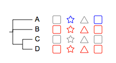
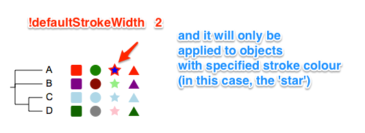
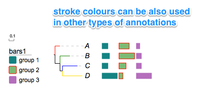
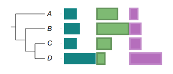

*Please email us ([Evolgenius Team](mailto:evolgenius.team@gmail.com)) if you have any questions; attach your datasets and trees if necessary.*

## Stroke color and width

### Table of contents

* [overview](#overview)
* [modifiers](#modifiers)
* [examples](#examples)
* [use 'darker' or 'brighter' as stroke color](#use)

{anchor:overview}

### Overview

One potential use of stroke colour is to make hollowed shapes like the following:



here is the tree:

```
(A:0.1,B:0.2,(C:0.3,D:0.4)100:0.5)90:0.43;
```

and the dataset (Color strips):

```
##color strips
!defaultstrokewidth	1
!type	rect,star,triangle,rect
!showlegends	0
A	white:grey,white:blue
B	white:red
C	white:grey
D	white:red
```

In EvolView, the colour attribute of an object can be written as :

```
fill_color[:stroke_color](_stroke_color)
```

When the stroke_color is omitted, no stroke will be drawn.

{anchor:modifiers}

### Related modifiers

_NOTE: not all datasets support these modifiers._
_**!defaultStrokeWidth**_

By default, a stroke width of '1' (one pixel) will be used; this can be changed by using a modifier:

```
!defaultStrokeWidth	stroke_width_value
```

**Note:**

* always separate the key and attributes with a single TAB character
* this value will be applied to all shapes.

_**!defaultStrokeColor**_

A default colour can also be specified by the following modifier:

```
!defaultStrokeColor	valid_stroke_color
```             

and it will be applied to shapes without user-supplied stroke colours.

{anchor:examples}

### Examples

example 1:

```
##color strips
!defaultstrokewidth	2
!type	rect,circle,star,triangle
!showlegends	1
A	red,green,blue:red
B	purple,darkred,lightgreen
C	lightblue
D	darkgreen,grey,pink
```



example 2:

```
##color strips
!defaultstrokewidth	2
!defaultstrokecolor	gold
!type	rect,circle,star,triangle
!showlegends	1
A	red,green,blue:red
B	purple,darkred,lightgreen
C	lightblue
D	darkgreen,grey,pink
```


example 3:

```
## a bar plot
!groups	group 1,group 2,group 3
!colors	#028482,#7ABA7A:red,#B76EB8
!align
!itemHeightPCT	60
A	8,13,5
B	10,20,7
C	8,9,7
D	20,5,20
```



Have fun!!

{anchor:use}

### use 'darker' or 'brighter' as stroke color

When color is specified and is not 'black' or 'white', users can now use darker or brighter version of the sepcified color as stroke color.

For example, the following usages are all valid:

* red:darker
* #FF00FF:lighter
* darkblue:brighter

When 'darker' or 'brighter'/'lighter' is used, the stroke color will be _**20% darker or brighter**_ than the specified color.

Here is an example, more examples will come.

Let's use the tree mentioned above.

```
## a bar plot uses 'darker' and 'brighter' as stroke colors
## see the !colors line below:
!defaultstrokewidth	3

## -- now you can use 'darker' or 'lighter' as stroke color
!groups	group 1,group 2,group 3
!colors	#028482,#7ABA7A:darker,#B76EB8:lighter

!title	Example of barplots 4
!plotwidth	200
!showLegends	0
!itemheightPCT	75
!align
A	8,13,5
B	10,20,7
C	8,9,7
D	20,5,20
```




[<< previous section: datasets overview](/datasets/00_overview/DatasetOverview.md)      |       [next section: pie chart >>](/datasets/02_pie/DatasetPieCharts.md)
