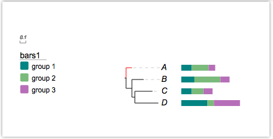
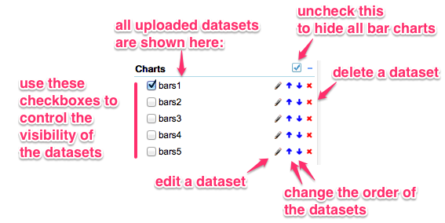
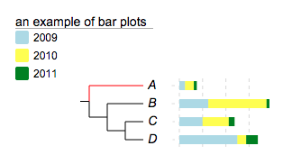
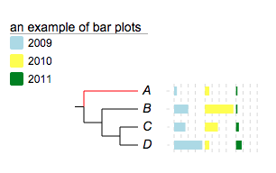
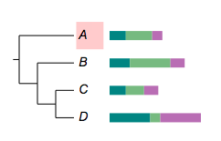
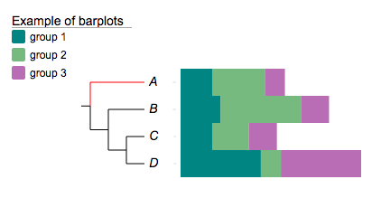
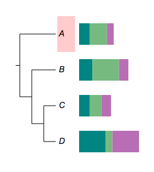
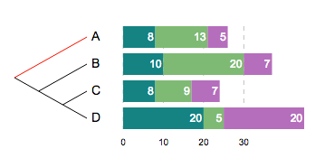
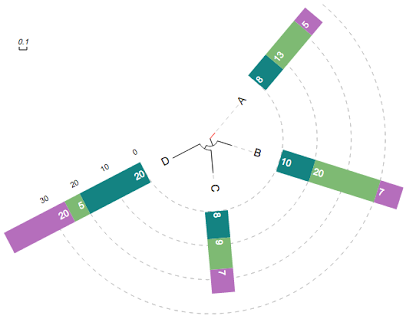

*Please email us ([Evolgenius Team](mailto:evolgenius.team@gmail.com)) if you have any questions; attach your datasets and trees if necessary.*

## Bars

### Index

* [overview](#overview)
* [modifiers](#modifiers)
* [examples](#examples)
* [show data value](#show-data-value)

{anchor:overview}

### Overview

Bar charts will be displayed next to leaf labels. For example:



Multiple bar-chart datasets can be uploaded to a tree and shown next to each other; uploaded datasets can be managed using the control panel:



{anchor:modifiers}

### Supported modifiers

The following 'modifiers' (Key-Value pairs) are supported for bar charts:

Key (case insensitive)|Value|Description
----------------------|-----|-----------
|**universal modifiers**| | |
|!Groups or !LegendText|comma separated text|Legend texts; for example 'group_a,group_b,group_c'|
|!LegendStyle or !Style|rect or circle or star|shapes to be plotted before the legend texts; default = rect|
|!LegendColors or !Colors|comma separated color codes or names|colors to be applied to the shapes specified by LegendStyle; for example 'red,green,yellow' ; note the number of colors should match the number of legend fields|
|!Title or !Legend|text|title of the legend; default = name of the dataset|
|!ShowLegends|0 or 1|0 : hide legends; 1 : show legends|
|!opacity|float number between 0 to 1|opacity of the dataset|
|**none pie chart modifiers**| |modifiers that apply to some charts but not to pies|
|!PlotWidth|integer > 0|pixel width of the dataset on canvas|
|!itemHeightPX or !barHeightPX|integer > 0|pixel height of each bar; see examples bellow|
|!itemHeightPCT or !barHeightPCT|float number between 1 to 100|percentage of available height taken by each bar; see examples bellow|
|!grid|none|show a background grid|
|!gridlabel or !axis|none|show the values corresponding to the grid lines|
|**bar charts specific**| | |
|!align or !alignIndividualColumn|none|align individual columns if the bars are stacked|
|!Fanplot or ! Fan|none|works only with circular tree; see examples bellow|
|**new: show data values**|see section show data value for more details| |

_**notes on preparing your datasets!!**_

1. please always use TAB to separate the modifiers and their values.
2. some modifiers should not be used in combination, e.g. !itemHeightPX and !itemHeightPCT.
3. However if both are used (accidentally), only !itemHeightPX be used.
4. if a modifier is used (accidentally) multiple tiles, only the last one will be used.
5. the "data" part of this dataset can only contain two columns of tab-delimited texts; the third column, if presents, will be ignored
6. please also always use TAB to separate the columns in the data section.

{anchor:examples}

### Examples

The tree :

```
(A:0.1,(B:0.2,(C:0.3,D:0.4)100:0.05)100:0.1)90:0.43;
```

Example 1:

```
##barplots
!groups	2009,2010,2011
!colors	lightblue,yellow,green
!showLegends	1
!plotwidth	100
!style	rect
!title	an example of bar plots
A	2,3,1
B	10,20,1
C	8,9,2
D	20,3,4
```


Example 2 (the same as the first one, with the following additional lines):

```
## turn grid on
!grid
```



Example 3 (the same as the first one, with the following additional lines):

```
## turn grid on
## align individual columns
!grid
!align
```



Example 4:

```
## fan plot of the bars in circular mode
!Fanplot
```


Example 5:

```
## grid and grid label
!groups	group 1,group 2,group 3
!colors	#028482,#7ABA7A,#B76EB8
!grid
!gridlabel
A	8,13,5
B	10,20,7
C	8,9,7
D	20,5,20
```


Example 6:

```
## fan plot of the bars in circular mode
## and align individual columns
!groups	group 1,group 2,group 3
!colors	#028482,#7ABA7A,#B76EB8
!fanplot
!align
A	8,13,5
B	10,20,7
C	8,9,7
D	20,5,20
```


_**heights of individual bars**_

By default, the height of an individual bar is 10 pixel, it can be changed using two modifiers:

* !itemHeightPX
* !itemHeightPCT
**!itemHeightPX** specifies the absolute pixel height for individual bars; its value ranges from >0 to 40. Here are some examples:

Example 1 on item/ bar height:

```
!groups	group 1,group 2,group 3
!colors	#028482,#7ABA7A,#B76EB8
## -- set height for individual bars --
## -- default value is 10 --
!itemHeightPX	10
A	8,13,5
B	10,20,7
C	8,9,7
D	20,5,20
```



Example 2 on item/bar height:

```
!groups	group 1,group 2,group 3
!colors	#028482,#7ABA7A,#B76EB8
## -- now we change the height to 20 --
!itemHeightPX	20
A	8,13,5
B	10,20,7
C	8,9,7
D	20,5,20
```


Example 3 on bar height:

```
!groups	group 1,group 2,group 3
!colors	#028482,#7ABA7A,#B76EB8
## -- if the pixel height is larger than the available space,
## -- which is 30 pixel in this case,
## -- only available space will be taken by the bars (30 pixel)
!itemHeightPX	35
A	8,13,5
B	10,20,7
C	8,9,7
D	20,5,20
```



**!itemHeightPCT** specifies the percentage of available space taken by a bar; its value ranges from 1 to 100.
Example 4 on bar height:

```
!groups	group 1,group 2,group 3
!colors	#028482,#7ABA7A,#B76EB8
## -- let's first of all take 60% of the space ... --
!itemHeightPCT	60
A	8,13,5
B	10,20,7
C	8,9,7
D	20,5,20
```


Example 5 on bar height:

```
!groups	group 1,group 2,group 3
!colors	#028482,#7ABA7A,#B76EB8
## -- bar height increases / decreases with increasing / decreasing vertical scale --
## -- still taking 60% of the space ... --
!itemHeightPCT	60
A	8,13,5
B	10,20,7
C	8,9,7
D	20,5,20
```



Example 6 on bar height:

```
## --
```


{anchor:show data value}

### Show data values
First, let's see an example:
the tree :

```
(A:0.1,(B:0.2,(C:0.3,D:0.4)100:0.05)100:0.1)90:0.43;
```

the dataset (copy & paste) :

```
!groups	group 1,group 2,group 3
!colors	#028482,#7ABA7A,#B76EB8
!title	Example of barplots 4
!plotwidth	200
!itemHeightPCT	80
!grid
!axis
!showLegends	0
!showdataValue	show=1,fontsize=12,fontitalic=1,textalign=end
A	8,13,5
B	10,20,7
C	8,9,7
D	20,5,20
```

and the result:


A bit more details on supported features:


The 'value' of the 'key' !showdataValue can be any combination of the following, separated by a ",":

key-value|alternative value|description
---------|-----------------|-----------
|show = 1|0|show or hide data values; optional; the data values will be shown if omitted|
|fontsize=12|any integer|set font size; optional; default = 10|
|fontcolor=red|any value color name|set text color; optional; default = black|
|fontitalic=1|0|set font italic; optional; default = 0|
|textalign=middle|start or end|set text align; optional; default = middle; see the following examples|

Example 1 on show data value:

```
!groups	group 1,group 2,group 3
!colors	#028482,#7ABA7A,#B76EB8
!title	Example of barplots 4
!plotwidth	200
!itemHeightPCT	80
!grid
!axis
!showLegends	0
!showdataValue	show=1,fontsize=12,fontitalic=1,textalign=end,fontcolor=white
A	8,13,5
B	10,20,7
C	8,9,7
D	20,5,20
```



Example 2 on show data value, align the values to the end of the bars:

```
!groups	group 1,group 2,group 3
!colors	#028482,#7ABA7A,#B76EB8
!title	Example of barplots 4
!plotwidth	200
!itemHeightPCT	80
!grid
!axis
!showLegends	0
!showdataValue	show=1,fontsize=12,fontitalic=1,textalign=end,fontcolor=white
A	8,13,5
B	10,20,7
C	8,9,7
D	20,5,20
```


Example 3 on show data value, align the values to the start of the bars:

```
!groups	group 1,group 2,group 3
!colors	#028482,#7ABA7A,#B76EB8
!title	Example of barplots 4
!plotwidth	200
!itemHeightPCT	80
!grid
!axis
!showLegends	0
!showdataValue	show=1,fontsize=12,fontitalic=1,textalign=start,fontcolor=white
A	8,13,5
B	10,20,7
C	8,9,7
D	20,5,20
```



[<< previous section: pie chart](/datasets/02_pie/DatasetPieCharts.md)      |       [next section: branch color >>](/datasets/04_branch/DatasetBranchColor.md)
