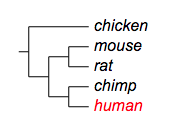
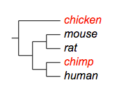

*Please email us ([Evolgenius Team](mailto:evolgenius.team@gmail.com)) if you have any questions; attach your datasets and trees if necessary.*

## Leaf colors

### Table of contents
* [overview](#overview)
* [modifiers](#modifiers)
* [data](#data)
* [examples](#examples)
* [add leaf color to a collapsed tree](#add-leaf-color-to-a-collapsed-tree)

{anchor:overview}
### Overview
Leaf colors will change the colors of leaf labels. Similar to branch colors, multiple datasets can be uploaded to a tree, but only one can be shown at a time.

{anchor:modifiers}
### Supported modifiers
Supported Key-Value pairs for leaf colors:
|Key (case insensitive)|Value|Description|
|----------------------|-----|-----------|
|!Groups or !LegendText|comma separated text|Legend texts; for example 'group_a,group_b,group_c'|
|!LegendStyle or !Style|rect or circle or star|shapes to be plotted before the legend texts; default = rect|
|!LegendColors or !Colors|comma separated color codes or names|colors to be applied to the shapes specified by LegendStyle; for example 'red,green,yellow' ; note the number of colors should match the number of legend fields|
|!Title or !Legend|text|title of the legend; default = name of the dataset|
|!ShowLegends|0 or 1|0 : hide legends; 1 : show legends|
|!opacity|float number between 0 to 1|opacity of the dataset|

{anchor:data}
### the data
Data are usually tab-delimited three-column texts, with the third column optional.
Let me use the tree below to illustrate the usage of the data:
```
(chicken,((mouse,rat),(chimp,human)));
```
* **first column: the location**
the first column dictates where the data to be plotted. It usually contains the name of a leaf node, or two leaf names separated by a ','.
* one single leaf name dictates that the data will be plotted on / next to / under the leaf or the branch connecting directly to the leaf node
* two leaf names are often used in combination with an 'ad' at the third column; see the section 'third column' for more details.
For example:
```
chicken
mouse,human
```
* **second column: color to be applied**
For example:
```
chicken	green
mouse,human	blue
```

* **third column: optional commands to change the default behavior of current line**
By default, the color will only apply to the specified leaf label; for example:
```
## leaf color
human	red
```

By adding a third column, the default behavior can be changed. Here is a list of choices of this column:
|Option (case insensitive)|Description|
|-------------------------|-----------|
|ad|apply color to the leaf labels of all descendants|
|prefix|apply color to all leaf labels that start with the string specified by the first column|
|suffix|apply color to all leaf labels that end with the string specified by the first column|
|anywhere|apply color to leaf labels that contain the string specified by the first column|
See examples below.

{anchor:examples}
### Examples
Example 1, 'ad':
```
## leaf color
human,mouse	pink	ad
 ```

----
Example 2, 'prefix':
```
## leaf color
ch	yellow	prefix
```

----
Example 3, 'suffix':
```
## leaf color
n	blue	suffix
```

----
Example 4, 'anywhere'
```
## leaf color
m	purple	anywhere
```

{anchor:add leaf color to a collapsed tree}
### Add leaf color to a collapsed tree
Evolview supports collapsing at internal nodes; collapsed nodes are treated as leaf nodes. It is therefore very straightforward to add leaf color to a collapsed tree. See [here](/datasets/13_collapse_at_internal_nodes/DatasetCollapseInternalNodes.md) for more information.

[<< previous section: branch color](/datasets/04_branch/DatasetBranchColor.md)      |       [next section: leaf background color >>](/datasets/05_leaf/DatasetLeafBKColor.md)
