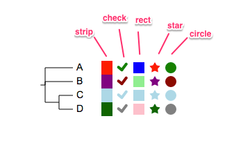
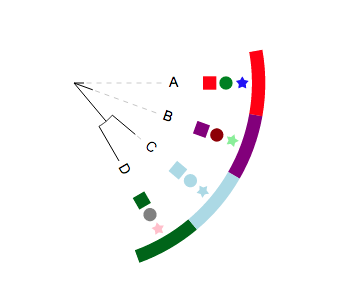
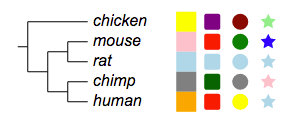
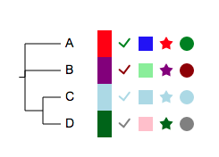
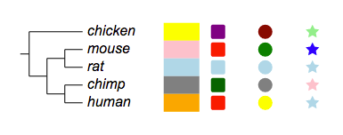
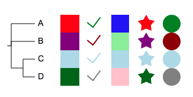
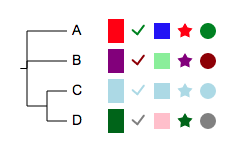
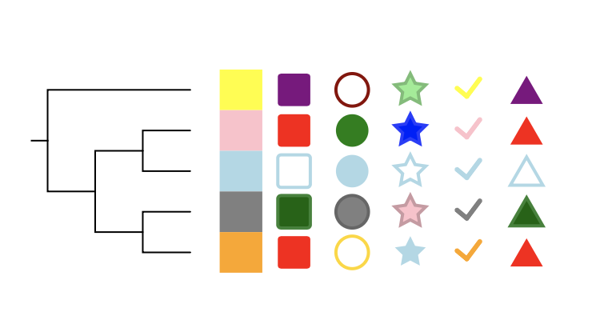

*Please email us ([Evolgenius Team](mailto:evolgenius.team@gmail.com)) if you have any questions; attach your datasets and trees if necessary.*

## Color strip and color shapes

### Table of contents
* [overview](#overview)
* [modifiers](#modifiers)
* [examples](#examples)
* [add color strips to collapsed trees](#add-color-strips-to-collapsed-trees)

{anchor:overview}
### Overview
Color strips and color shapes will be shown next to the leaf labels. Multiple datasets can be uploaded and displayed.
Here is an example:

the differences between 'rect' and 'strip' are:
* strip by default will take all available space of a leaf label, while rect will only take 80%
* strip looks like the following in circular mode, while rect remains the same.


{anchor:modifiers}
### Supported modifiers
|Key (case insensitive)|Value|Description|
|----------------------|-----|-----------|
|**universal modifiers**| | |
|!Groups or !LegendText|comma separated text|Legend texts; for example 'group_a,group_b,group_c'|
|!LegendStyle or !Style|rect or circle or star|shapes to be plotted before the legend texts; default = rect|
|!LegendColors or !Colors|comma separated color codes or names|colors to be applied to the shapes specified by LegendStyle; for example 'red,green,yellow' ; note the number of colors should match the number of legend fields|
|!Title or !Legend|text|title of the legend; default = name of the dataset|
|!ShowLegends|0 or 1|0 : hide legends; 1 : show legends|
|!opacity|float number between 0 to 1|opacity of the dataset|
|**none-universal modifiers**| | |
|!PlotWidth|integer > 0|pixel width of the dataset on canvas|
|!itemHeightPX or !barHeightPX|integer > 0|pixel height of each shape except 'strips'; see examples bellow|
|!itemHeightPCT or !barHeightPCT|float number between 1 to 100|percentage of available height taken by each shape except 'strips'; see examples bellow|
|!recycleColor or !colorRecycle|0 or 1|whether colors will be recycled; see examples bellow|
|**unique modifiers**| |modifiers for this annotation dataset only|
|!type or !types or !shape or !shapes|any one or combination of rect,star,circle,strip,check|see examples bellow|
|!stripHeightPX|integer > 0|pixel height for each strip; see examples bellow|
|!stripHeightPCT|float number between 1 to 100|percentage of available height taken each strip, see examples bellow|
|!checkLineWidth or !checklwd|integer > 0|line width of the 'check' symbol, see examples bellow|
**_notes on preparing your datasets!!_**
1. please always use TAB to separate the modifiers and their values.
2. modifier !type controls the number of shapes to be shown next to leaf labels
3. the "data" part of this dataset can only contain two columns of tab-delimited texts; the third column, if presents, will be ignored
	* the first column contains the name of a single leaf node
	* the second column contains comma (,) delimited colors; if the number of colors is less than the number of shapes, the colors will be recycled
4. please also always use TAB to separate the columns in the data section.

{anchor:examples}
### Examples
The tree:
```
(chicken,((mouse,rat),(chimp,human)));
```
Example 1:
```
##color strips
!type	strip,rect,circle,star
!showlegends	0

## let the data begin
mouse	pink,red,green,blue
chicken	yellow,purple,darkred,lightgreen
rat	lightblue
chimp	grey,darkgreen,grey,pink
human	orange,red,yellow,lightblue
```

----
**_notes on plot width, widths and heights of individual shapes_**
Here is how widths and heights of individual shapes are calculated:
* if a dataset contains multiple shapes, then the plot width will be divided equally among each shape
* each shape will take 80% of available width
* each shape will take 80% of available height, except strip, while will take 100%
* all shapes will be centered at the available space both vertically and horizontally
* for all shapes except strips, when the widths and heights are of different sizes, always the smaller ones will be chosen as their widths and heights
* by default, strips will take all of the available heights; however, user can change that using two modifiers !stripHeightPX and !stripHeightPCT. When both modifiers are used in the same dataset (by mistake), only !stripHeightPCT will be used.
Example 2:
```
##color strips
!type	strip,check,rect,star,circle
A	red,green,blue
B	purple,darkred,lightgreen
C	lightblue
D	darkgreen,grey,pink
```

----
Example 3, '!plotWidth':
```
##color strips
!type	strip,check,rect,star,circle
## plotwidth by default is 100; set to 200 in this example
!plotWidth	200
A	red,green,blue
B	purple,darkred,lightgreen
C	lightblue
D	darkgreen,grey,pink
```

----
Example 4, 'itemHeightPCT':
```
##color strips
!type	strip,check,rect,star,circle
!plotWidth	200
## -- shapes except strip will take 80% of available space; make it 100% in this example --
!itemHeightPCT	100
A	red,green,blue
B	purple,darkred,lightgreen
C	lightblue
D	darkgreen,grey,pink
```

----
Example 5, '!stripHeightPCT':
```
##color strips
!type	strip,check,rect,star,circle
## -- by default, strip will always take 100% available height; make it 80 in this example --
!stripHeightPCT	80
A	red,green,blue
B	purple,darkred,lightgreen
C	lightblue
D	darkgreen,grey,pink
```

----
Example 6, the same as previous dataset, and the tree is plotted in circular mode:

----
Example 7, '!checkLineWidth':
```
##color strips
!type	strip,check,rect,star,circle
## -- by default, check has a line width of 2 pixel; make it 5 --
!checkLineWidth	5
A	red,green,blue
B	purple,darkred,lightgreen
C	lightblue
D	darkgreen,grey,pink
```


----
Example 8, '!recycleColor' or '!colorRecycle':
```

##color strips
!type	strip,rect,circle,star,check,triangle
!showlegends	1
!defaultstrokewidth	2
!plotwidth	200

## -- recycle color, default is true --
## -- !type determines that maximally six objects will be displayed
## -- normally user-supplied colors will be recycled; for example,
## -- however, when !recycleColor is set to 0, the colors will not be recycled
!colorRecycle	0

## let the data begin
mouse	pink,red,green,blue:brighter
chicken	yellow,purple,white:darkred,lightgreen:darker

## -- two objects will be plotted instead of six --
rat	lightblue,white:lightblue
chimp	grey,darkgreen:brighter,grey:darker,pink:darker
human	orange,red,white:gold,lightblue
```


----
Example 9, '!recycleColor' or '!colorRecycle':
```

##color strips
!type	strip,rect,circle,star,check,triangle
!showlegends	1
!defaultstrokewidth	2
!plotwidth	200
!colorRecycle	1

## let the data begin
mouse	pink,red,green,blue:brighter
chicken	yellow,purple,white:darkred,lightgreen:darker

## -- two objects will be plotted instead of six --
rat	lightblue,white:lightblue
chimp	grey,darkgreen:brighter,grey:darker,pink:darker
human	orange,red,white:gold,lightblue
```


----
{anchor:add color strips to collapsed trees}
### add color strips to collapsed trees
See [here](/datasets/13_collapse_at_internal_nodes/DatasetCollapseInternalNodes.md) for details on adding color strips to a collapsed tree.
