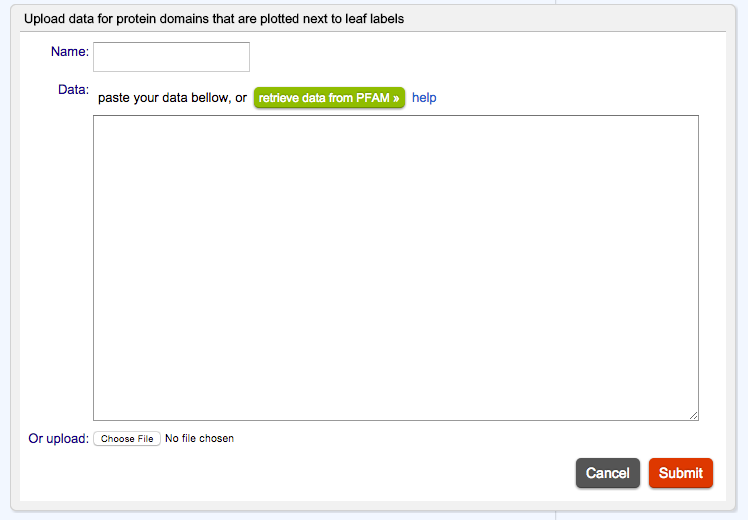

*Please email us ([Evolgenius Team](mailto:evolgenius.team@gmail.com)) if you have any questions; attach your datasets and trees if necessary.*

## Protein domains

### Index
* [overview](#overview)
* [automatic retrieval of domain annotations from PFAM](#automatic-retrieval-of-domain-annotations-from-PFAM)
* [write domain annotations by hand](#write-domain-annotations-by-hand)
* [modifiers](#modifiers)
* [examples](#examples)
* [issues](#issues)

{anchor:overview}
### Overview
To upload a dataset for domain annotations, user can simply go to the "Annotation upload" tab, and click the "protein domain" icon:

A dialogbox will then appear:

User can choose to either copy and paste the contents of the dataset by hand, upload from a text file, or retrieve automatically from public resources like PFAM.

{anchor:automatic retrieval of domain annotations from PFAM}
### automatic retrieval of domain annotations from PFAM
To retrieve domains automatically from PFAM, user can simply click the green button "retrieve data from PFAM" (see figure above).
EvolView uses leaf names of current active tree to query PFAM database using the PFAM URL API. For example, if a leaf name is "KLF9_HUMAN", the URL to retrieve data will look like:
```
http://pfam.xfam.org/protein/KLF9_HUMAN?output=xml
```
The retrieved data is in XML format, as shown bellow:
```
<xml version="1.0" encoding="UTF-8">
<!-- information on UniProt entry Q13886 (KLF9_HUMAN), generated: 12:24:51 15-May-2012 -->
<pfam xmlns:xsi="http://www.w3.org/2001/XMLSchema-instance"
      xmlns="http://pfam.sanger.ac.uk/"
      xsi:schemaLocation="http://pfam.sanger.ac.uk/
                          http://pfam.sanger.ac.uk/static/documents/schemas/protein.xsd"
      release="26.0"
      release_date="2011-11-17">
  <entry entry_type="sequence" db="uniprot" db_release="2011_06" accession="Q13886" id="KLF9_HUMAN">
    <description>
<![CDATA[
Krueppel-like factor 9
]]>
    </description>
    <taxonomy tax_id="9606" species_name="Homo sapiens (Human)">Eukaryota; Metazoa; Chordata; Craniata; Vertebrata; Euteleostomi; Mammalia; Eutheria; Euarchontoglires; Primates; Haplorrhini; Catarrhini; Hominidae; Homo.</taxonomy>
    <sequence length="244" md5="c97fb18568b42285ca3d528c6af3bd36" crc64="2D1B5A5BB9D42221" version="1">MSAAAYMDFVAAQCLVSISNRAAVPEHGVAPDAERLRLPEREVTKEHGDPGDTWKDYCTLVTIAKSLLDLNKYRPIQTPSVCSDSLESPDEDMGSDSDVTTESGSSPSHSPEERQDPGSAPSPLSLLHPGVAAKGKHASEKRHKCPYSGCGKVYGKSSHLKAHYRVHTGERPFPCTWPDCLKKFSRSDELTRHYRTHTGEKQFRCPLCEKRFMRSDHLTKHARRHTEFHPSMIKRSKKALANAL</sequence>
    <matches>
      <match accession="PF13465" id="zf-H2C2_2" type="Pfam-A">
        <location start="189" end="212" ali_start="190" ali_end="212"
hmm_start="2" hmm_end="24" evalue="5.4e-05" bitscore="32.80" />
      </match>
      <match accession="PF13465" id="zf-H2C2_2" type="Pfam-A">
        <location start="159" end="186" ali_start="159" ali_end="186" hmm_start="1" hmm_end="26" evalue="0.0036" bitscore="27.00" />
      </match>
      <match accession="PB021241" id="Pfam-B_21241" type="Pfam-B">
        <location start="1" end="158" />
      </match>
    </matches>
  </entry>
</pfam>
```
EvolView will parse the retrieved data, and paste the results to the text box bellow the button.
By default, several "modifiers" will be automatically generated and added to the beginning of the dataset (see the figure above).

**_Now let's show an example of retrieving annotation from PFAM._**
First, we add the following tree to a project:
```
((((((((KLH20_XENLA:0.2153,((Q86BQ6_DROME:0.2096,Q7PXP7_ANOGA:0.1568)0.85:0.2135,
((Q6PFE1_MOUSE:0.1521,Q6PGA3_MOUSE:0.2172)0.76:0.07388,Q8CCY1_MOUSE:0.1753)
0.95:0.3455)0.91:0.3338)0.86:0.2197,((KLHL2_HUMAN:0.08975,(Q8N4I8_HUMAN:0,
(Q18670_CAEEL:0.7637,KLH12_XENLA:0.2797)0.93:0.4654)0.88:0.1558)0.82:0.1293,
(KELC_ANOST:0.1794,KELC_DROME:0.1742)0.9:0.2075)0.94:0.2985)0.29:0.04967,
(((Q8AW66_DANRE:0.1259,KLHL6_MOUSE:0.4485)0.98:0.4727,(KBTBC_MOUSE:0.6317,
(KBTB8_HUMAN:0.1993,Q8JU17_LSDV:1.141)0.9:0.5857)0:0)0.82:0.2108,
((((KEAP1_RAT:0.1349,Q8JIM0_DANRE:0.2407)0.95:0.4784,Q7KSF5_DROME:0.5027)
0:0.06034,GAN_MOUSE:0.8177)0.73:0.1347,(((KLH38_MOUSE:0.668,
((Q7SYC4_DANRE:0.3353,Q6NRT8_XENLA:0.2334)0.88:0.275,KLH29_MOUSE:0.5729)
0:0.03749)0.81:0.1223,((((O61795_CAEEL:0.6747,(((Q9Q8G2_9POXV:0.6023,
Q8V3G0_SWPV:0.6185)0.72:0.4076,Q9DHH3_YLDV:0.3759)0:0.1171,KBTB1_CWPXG:0.8456)
0.98:1.164)0:0.0495,(Q9W6R2_TAKRU:0.2735,Q9W6R3_TAKRU:0.6931)0.84:0.2291)0:0,
(Q7Q1T2_ANOGA:0.5814,Q7ZVF7_DANRE:1.067)0.014:0.1921)0.81:0.1635,
((Q6P4N4_XENTR:0.1512,Q7SYD2_DANRE:0.4405)0.8:0.1838,KBTBA_HUMAN:0.02277)
1:0.5769)0.57:0.0335)0.27:0.06992,Q6GKZ1_DROME:0.7147)0.85:0.1895)0:0.00953)
0.65:0.08898)0.72:0.1007,(Q7QHD7_ANOGA:0.3004,Q9VGE5_DROME:0.3033)0.95:0.262)0:0,
(((((ENC2_MOUSE:0.3014,(ENC2_XENLA:0.05783,((Q6TEQ2_DANRE:0.09609,
Q6GNW3_XENLA:0.2931)0.86:0.1782,ENC1_HUMAN:0.2725)0.95:0.3066)0.8:0.1403)
0.98:0.551,Q6IR89_XENLA:0.415)0.75:0.07768,KBTB3_HUMAN:1.07)0.67:0.1062,
KLH28_MOUSE:0.9934)0.61:0.08269,(KLH17_MOUSE:0.4396,(Q6IQ87_DANRE:0.1242,
KLH18_HUMAN:0.08026)0.79:0.1194)0.73:0.1527)0.86:0.1814)0.73:0.04515,
(Q8IQ29_DROME:1.127,KLH23_MOUSE:0.7506)0.83:0.6781)0.81:0.1032,
((O18147_CAEEL:0.4752,(Q6GNZ5_XENLA:0.1637,IPP_MOUSE:0.1366)0.93:0.3711)
0.81:0.1438,KLHL8_MOUSE:0.6621)0:0)0.83:0.2138,(Q6DJ21_XENTR:0.5388,
(((Q9VK21_DROME:0.2861,Q7PMB5_ANOGA:0.3132)0.95:0.4708,((((Q8IH95_DROME:1.015,
Q9W4S3_DROME:1.086)0.66:0.1906,Q9W4L5_DROME:0.4058)0.91:0.7326,
((((Q9W2S3_DROME:0.2141,O16313_CAEEL:0.8251)0.3:0.1505,(Q8C2V5_MOUSE:0.3688,
Q6GML3_DANRE:0.2594)0.94:0.3389)0:0.04204,Q7QI84_ANOGA:0.3114)0.88:0.4656,
(BTBDH_MOUSE:0.1753,BTBDH_XENLA:0.1789)0.96:0.803)0.84:0.4615)0.6:0.1801,
((O72746_COWPX:1.098,(Q8JTN6_LSDV:0.1404,Q8JTM8_LSDV:1.095)0.82:0.7468)
0.84:0.6953,P87597_COWPX:1.193)0.69:0.3544)0.79:0.2198)0.63:0.08743,
((((KLH21_DANRE:0.1926,KLH21_HUMAN:0.5162)0.59:0.2868,(KLH31_MOUSE:0.2558,
KLH31_DANRE:0.04945)0.96:0.5586)0.76:0.2286,KLH30_XENLA:1.462)0.099:0.209,
(Q6DE07_XENLA:0.4094,(KLH26_MOUSE:0.5299,KLH36_HUMAN:1.102)0:0.09303)0.93:0.4958)
0.12:0.124)0.77:0.173)0.83:0.00212);
```
Second, go to the "Annotation upload" tab, click the "protein domain" icon, and then click the "retrieve data from PFAM" icon in the dialogbox. User will get a busy message during the data retrieval.
Last, click the "Submit" button if there is no error, the domains will be plotted next to the tree (only partial plot is shown):


{anchor:write domain annotations by hand}
### Write domain annotations by hand
A typical domain annotation for a protein looks like the following:
```
KLF9_HUMAN	244	189,212,zf-H2C2_2,Pfam-A,,,PF13465,5.4e-05,32.80	159,186,zf-H2C2_2,Pfam-A,,,PF13465,0.0036,27.00
```
The first two columns are protein name and protein length, respectively. The third and four columns are two domains for this protein. More columns can be appended to the end of the same line.

**Columns are separated by a single 'tab' symbol**, so that user can prepare the annotation using any standard spreadsheet program (for example Office Excel, iWorks Numbers and LibreOffice Calc).

Typically a domain-architecture column contains the following nine fields separated by ","s:

in which the first two are mandatory; the rest can be left blank if not available.

For example, the following domain annotations are all valid:
```
159,186
159,186,WD40
159,186,WD40,Pfam-A
159,186,,Pfam-A
159,186,zf-H2C2_2,Pfam-A,,,PF13465
159,186,zf-H2C2_2,Pfam-A,,,,0.0036,27.00
159,186,zf-H2C2_2,Pfam-A,,,PF13465,0.0036,27.00
```

{anchor:modifiers}
### Supported modifiers
|Key (case insensitive)|Value|Description|
|----------------------|-----|-----------|
|**universal modifiers**| | |
|!Groups or !LegendText|comma separated text|Legend texts; for example 'group_a,group_b,group_c'|
|!LegendColors or !Colors|comma separated color codes or names|colors to be applied to the shapes specified by LegendStyle; for example 'red,green,yellow' ;note the number of colors should match the number of legend fields|
|!Title or !Legend|text|title of the legend; default = name of the dataset|
|!ShowLegends|0 or 1|0 : hide legends; 1 : show legends|
|!opacity|float number between 0 to 1|opacity of the dataset|
|**none pie chart modifiers**| |modifiers that apply to all charts except pies|
|!PlotWidth|integer > 0|pixel width of the dataset on canvas|
|!itemHeightPX or !barHeightPX or !PlotHeight (deprecated) or !Height (deprecated)|integer > 0|pixel height of each bar; similar to bar chart|
|!itemHeightPCT or !barHeightPCT|float number between 1 to 100|percentage of available height taken by each bar; similar to bar chart|
|!grid|none|show a background grid|
|!gridlabel or !axis|none|show the values (protein length) corresponding to the grid lines|
|**unique modifiers**| |modifiers unique to this annotation|
|!shadow or !showShadow|0 or 1|1: show drop shadow under non-PFAM-B domains; WARNING: if shadow is on, exporting to graphical formats other than SVG is NOT functional!!|

**_notes on preparing your datasets!!_**
1. please always use TAB to separate the modifiers and their values.
2. please also always use TAB to separate the columns in the data section.


{anchor:examples}
### Examples
more examples will be added.

{anchor:issues}
### Known issues
Exporting to graphical formats other than SVG is not functional if '!shadow' option is on.
