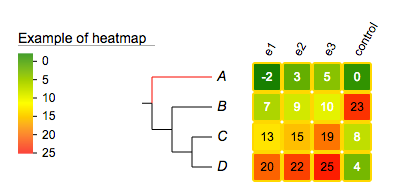
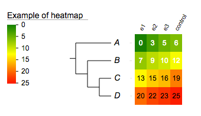
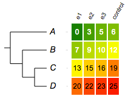
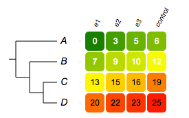
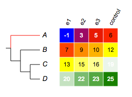
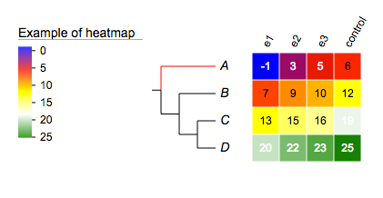
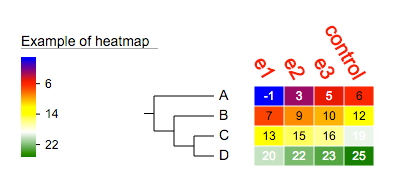

*Please email us ([Evolgenius Team](mailto:evolgenius.team@gmail.com)) if you have any questions; attach your datasets and trees if necessary.*

## Heatmap
### Table of contents
* [overview](#overview)
* [modifiers](#modifiers)
* [strokes](#strokes)
* [the !heatmap modifier](#the-!heatmap-modifier)
* [show data value](#show-data-value)
* [color gradient](#color-gradient)
* [tick labels of the color gradient of the legend](#tick-labels-of-the-color-gradient-of-the-legend)
* [column label style customisation](#column-label-style-customisation)
* [add heatmap to collapsed trees](#add-heatmap-to-collapsed-trees)

{anchor:overview}
### Overview

**_note:_**
1. please consult the tree 'heatmaps' in the DEMOS project to see the Heatmap in action
2. when exported to pdf using Firefox, the color gradient in the legend is known to be wrong; therefore Google Chrome is strongly recommended.

First, let's see some examples.

The tree:

```
(A:0.1,(B:0.2,(C:0.3,D:0.4)100:0.05)100:0.1)90:0.43;
```

... and an example dataset:

```
#heatmap
!legendTitle	Example of heatmap
!showLegends	1
#!defaultStrokeColor	pink
#!defaultStrokeWidth	2
!colorgradient	blue, yellow,red
!colorgradientMarkLabel	0,5,10,15,20,25
# -- heatmap column labels --
!showHeatMapColumnLabel	1
!heatmapColumnLabels	e1,e2,e3,control
# -- heatmap --
!heatmap	margin=2,colwidth=30,roundedcorner=2
# -- show data value
!showdataValue	show=1,fontsize=12,fontitalic=0,textalign=start
A	-2,3,5,0
B	7,9,10,23
C	13,15,19,8
D	20,22,25,4
```

here is how the plot looks like (with annotations):


{anchor:modifiers}
### Supported modifiers
The following 'modifiers' (Key-Value pairs) are supported for heatmap:

|Key (case insensitive)|Value|Description|
|----------------------|-----|-----------|
| **universal modifiers** | | |
|!Title or !Legend|text|title of the legend; default = name of the dataset|
|!ShowLegends|0 or 1|0 : hide legends; 1 : show legends|
|!opacity|float number between 0 to 1|opacity of the dataset|
|**modifiers shared with Bar Charts and Dot plots**| |modifiers that apply to both Bar Charts, Dot Plots and Heatmap|
|!gridlabel or !axis or !showHeatMapColumnLabel|none, or any integer; 0 : hide column labels; >= 1: show column labels; note: using !showHeatMapColumnLabel here is recommended|show heatmap column labels (note: does not work in circular modes)|
|!columnLabelStyle|tweak column label styles; see section 'colum label style' for detail| |
|!defaultStrokeWidth|any value >= 0|stroke width that applies to both legends and the chart|
|!defaultStrokeColor|any valid color name such as red and yellow and html hex color such as #FF00FF|stroke color that applies to both legends and the chart; see more about stroke colors; also see the section bellow|
|**heatmap specific**| | |
|!colorgradient or !colorspectrum|two or more valid colors separated by ','; a color gradient will be generated using the specified colors (see more examples bellow); this modifier is mandatory|valid colors include html color names (such as red, yellow, lightblue; see here for a complete list of supported html color names) as well as html hex colors such as #FF00FF|
|!colorgradientMarkLabel or !colorgradientMarkLabels|one or more valid numbers separated by ',' such as -3,2,5,7,9,10.5; see bellow for more examples|numbers to be plotted in the legend next to the color gradient|
|!heatmapColumnLabel or !heatmapColumnLabels or |one or more text strings separated by ',', such as trait 1,trait 2,control; see bellow for more examples|texts to be plotted on the top of the heatmap, each text string corresponds to a column of the heatmap; NOTE not implemented yet in circular mode|
|!colorGradientPixelHeight or !colorGradientHeight|any integer > 1|pixel height of the color gradient in the legend, default = 100|
|!colorGradientPixelWidth or !colorGradientWidth|any integer > 1|pixel width of the color gradient in the legend, default = 15|
|!heatmap|see section the !heatmap modifier|optional|
|**show data values**|see section show data value for more details| |
|**unsupported modifiers**|modifiers that are not supported in Heatmap| |
|!Groups or !LegendText| | |
|!LegendStyle or !Style| | |
|!LegendColors or !Colors| | |
|!grid| | |
|!plotwidth| |

**_notes on preparing your datasets!!_**
1. please always use TAB to separate the modifiers and their values.
2. if a modifier is used (accidentally) multiple tiles, only the last one will be used.
3. the "data" part of this dataset can only contain two columns of tab-delimited texts; the third column, if presents, will be ignored
4. please also always use TAB to separate the columns in the data section.

{anchor:strokes}
### Strokes
Stroke color and width is supported in heat plot; the corresponding modifiers are **!defaultStrokeColor** and
**!defaultStrokeWidth**.
**!defaultStrokeWidth** is optional with the default value of 1.

Here is an example:

```
#heatmap
!title	Example of heatmap
!showLegends	1
!defaultStrokeColor	gold
!defaultStrokeWidth	2
!colorgradient	green, yellow,red
!colorgradientMarkLabel	0,5,10,15,20,25
# -- heatmap column labels --
!showHeatMapColumnLabel	1
!heatmapColumnLabels	e1,e2,e3,control
# -- heatmap --
!heatmap	margin=2,colwidth=30,roundedcorner=2
# -- show data value
!showdataValue	show=1,fontsize=12
A	-2,3,5,0
B	7,9,10,23
C	13,15,19,8
D	20,22,25,4
```



{anchor:the !heatmap modifier}
### the !heatmap modifier
The 'value' of the modifier **!heatmap** can be any combination of the following, separated by a ",":

```
margin=2,colwidth=30,roundedcorner=2
```

Please note the !heatmap modifier is optional; if omitted, default values will be used.

|key|alternative value|description|
|---|-----------------|-----------|
|colwidth=30|any integer > 0|set pixel width per column ; optional; default = 20|
|margin=2|any integer >= 0|set pixel space between columns; optional; default = 0|
|roundedcorner=1|any integer >= 0|set rounded corner in pixels for rectangular; valid when shape=rect; optional, default = 0|

Here are examples showing how these attributes work.

Example 1, no !heatmap, everything is by default:

```
#heatmap
!title	Example of heatmap
!showLegends	1
#!defaultStrokeColor	gold
#!defaultStrokeWidth	2
!colorgradient	green, yellow,red
!colorgradientMarkLabel	0,5,10,15,20,25
# -- heatmap column labels --
!showHeatMapColumnLabel	1
!heatmapColumnLabels	e1,e2,e3,control
# -- heatmap --
#!heatmap	margin=2,colwidth=30,roundedcorner=2
# -- show data value
!showdataValue	show=1,fontsize=12
A	0,3,5,6
B	7,9,10,12
C	13,15,16,19
D	20,22,23,25
```



----

Example 2, margin=2:

```
!heatmap	margin=2,colwidth=20
```



----

Example 3, roundedcorner=5:

```
!heatmap	margin=2,colwidth=30,roundedcorner=5
```



{anchor:show data value}
### Show data value
Heatmap supports the **!showdataValue** modifier; the 'value' of **!showdataValue** can be any combination of the following, separated by a ",":

|key|alternative value|description|
|---|-----------------|-----------|
|show = 1|0|show or hide data values; optional; the data values will be shown if omitted|
|fontsize=12|any integer|set font size; optional; default = 10|
|fontcolor=red|any value color name|set text color; optional; default = 'black' or 'white' depending on the background color|
|fontitalic=1|0|set font italic; optional; default = 0|

**_NOTE_**: when 'fontcolor' is omitted, a 'black' or 'white' color will be chosen automatically depending the background color of each value in order to increase readability.

{anchor:color gradient}
### Color gradient
Creating color gradient is very easy in EvolView by using the !colorgradient or !colorspectrum modifier. Here are a few examples:

Example 1:

```
#heatmap
!title	Example of heatmap
!showLegends	1
#!defaultStrokeColor	gold
#!defaultStrokeWidth	2
!colorgradient	green,yellow,red
!colorgradientMarkLabel	0,5,10,15,20,25
# -- heatmap column labels --
!showHeatMapColumnLabel	1
!heatmapColumnLabels	e1,e2,e3,control
# -- heatmap --
!heatmap	margin=2,colwidth=30,roundedcorner=2
# -- show data value
!showdataValue	show=1,fontsize=12,fontitalic=0,textalign=start
A	0,3,5,6
B	7,9,10,12
C	13,15,16,19
D	20,22,23,25
```


----

Example 2:

```
## -- red to white to blue --
!colorgradient	red,white,blue
```


----

Example 3:

```
## -- grays; only two colors here --
!colorgradient	black,white
```


----

Example 4:

```
## -- use five colors this time --
!colorgradient	blue,red,yellow,white,green
```



{anchor:tick labels of the color gradient of the legend}
### Tick labels of the color gradient of the legend

EvolView calculates automatically where the ticks and tick labels to plot on the color gradient of the legend, based on the min and max of user data. However, the results are not always up to users' standard. Users can use modifier **!colorgradientMarkLabel** / **!colorgradientMarkLabels** to customize the tick labels.

The value of the modifier is one or more valid numbers, separated by ','. Here are some examples:

Example 1, color gradient tick labels are automatically positioned:

```
#heatmap
!title	Example of heatmap
!showLegends	1
!colorgradient	blue,red,yellow,white,green
!showHeatMapColumnLabel	1
!heatmapColumnLabels	e1,e2,e3,control
!heatmap	margin=1,colwidth=30,roundedcorner=0
!showdataValue	show=1,fontsize=12,fontitalic=0
A	-1,3,5,6
B	7,9,10,12
C	13,15,16,19
D	20,22,23,25
```


----

Example 2, customized tick labels using !colorgradientMarkLabel:

```
!colorgradientMarkLabel	0,5,10,15,20,25
```



{anchor:column label style customisation}
### column label style customisation

Heatmap also supports modifier **!columnLabelStyle**; the value of this modifier can be any combination of the following, separated by a ",":

|key|alternative value|description|
|---|-----------------|-----------|
|show = 1|0|show or hide data values; optional; if omitted, the column lables will be shown|
|fontsize=12|any integer|set font size; optional; default = 10|
|fontcolor=red|any value color name|set text color for all labels; optional; default = black|
|fontitalic=1|0|set font italic; optional; default = 0|
|fontbold=1|0|set font weight to bold; optional; default = 0|
|textangle=-60|any number(s)|set rotation angle; optional, default = -60|

Here is an example:

```
!title	Example of heatmap
!showLegends	1
!colorgradient	blue,red,yellow,white,green
!showHeatMapColumnLabel	1
!heatmapColumnLabels	e1,e2,e3,control
!heatmap	margin=1,colwidth=30,roundedcorner=0
!showdataValue	show=1,fontsize=12,fontitalic=0
!columLabelStyle	show=1,fontsize=20,fontitalic=0,fontbold=1,textangle=60,fontcolor=red
A	-1,3,5,6
B	7,9,10,12
C	13,15,16,19
D	20,22,23,25
```



{anchor:add heatmap to collapsed trees}
### Add heatmap to collapsed trees
Evolview supports collapsing at internal nodes; collapsed nodes are treated as leaf nodes. It is therefore very straightforward to add heatmaps to a collapsed tree. See [here](DatasetCollapseInternalNodes#heatmap) for more information.


[<< previous section: dot plot ](/datasets/09_dot_plot/DatasetDotplots.md)      |       [next section: bootstrap >>](/datasets/11_bootstrap/DatasetBootstrapValueStyle.md)
