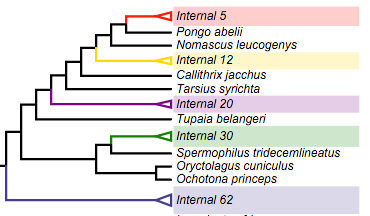
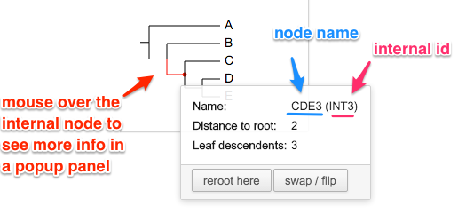
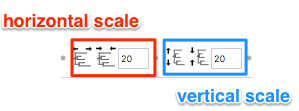
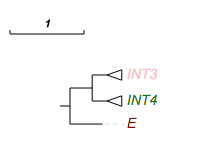
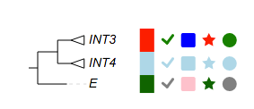
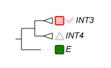
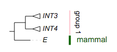
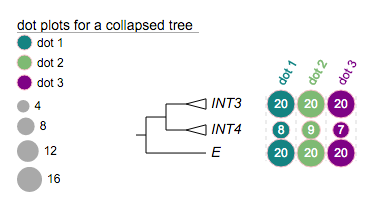
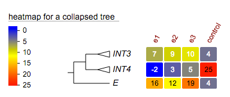
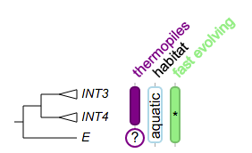

*Please email us ([Evolgenius Team](mailto:evolgenius.team@gmail.com)) if you have any questions; attach your datasets and trees if necessary.*

## Collapse at internal nodes

### Table of contents
* [overview](#overview)
* [modifiers](#supported-modifiers)
* [specify the internal node(s) to collapse](#specify-define-the-internal-nodes-to-collapse)
* [size of the triangles](#size-of-the-triangles)
* [customise the collapsed nodes](#customise-the-collapsed-nodes)
* [add datasets to a collapsed tree](#add-datasets-to-a-collapsed-tree)
	* [branch color](#branch-colors)
	* [leaf and background color](#leaf-colors-and-leaf-background-colors)
	* [color strips and objects](#color-shapes-and-strips)
	* [pie charts](#pie-charts)
	* [leaf label decorations](#leaf-label-decorations)
	* [group label](#group-label)
	* [dot plot](#dot-plot)
	* [heatmap](#heatmap)
	* [column plot](#column-plot)

### Overview
With this annotation type, users can :
* collapse at internal nodes
* show a small triangle at the collapsed nodes that is proportional to the number of leaves that the collapsed node contains

_**Please note**_
* a tree **CAN NOT** be collapsed at leaf nodes or the root
* this feature does **NOT** work in "slanted cladogram" mode

Datasets can be uploaded using the following button on the toolbar:


Here is an example:




### Supported modifiers
We didn't introduce new modifiers for this annotation type; only the following universal modifiers related to legends are supported:

|Key (case insensitive)|Value|Description|
|----------------------|-----|-----------|
|!Groups or !LegendText|comma separated text|Legend texts; for example 'group_a,group_b,group_c'|
|!LegendStyle or !Style|rect or circle or star|shapes to be plotted before the legend texts; default = rect|
|!LegendColors or !Colors|comma separated color codes or names|colors to be applied to the shapes specified by LegendStyle; for example 'red,green,yellow' ; note the number of colors should match the number of legend fields|
|!Title or !Legend|text|title of the legend; default = name of the dataset|
|!ShowLegends|0 or 1|0 : hide legends; 1 : show legends|

### Specify/ define the internal node(s) to collapse
The data part contains a list of internal nodes at which the tree should collapse. There are **three ways** of specifying an internal node. Let's take the following tree as an example:

```
(A,(B,(C,(D,E)2DE)CDE3)BC3DE)ROOT;
```


Now we try to collapse the tree at the last common ancestor of the leaf nodes "C" and "E". The simplest way is to upload a dataset with the following content:

```
C,E
```


----

Alternatively, users can point to the internal node by using its "internal id" or name (if available); to find out such information, simply mouseover the internal node of interest:



Therefore the above dataset is equivalent to:

```
## internal id
INT3
```

... or

```
## name of the internal node
CDE3
```

Please consult [this wiki](SupportedTreeFormats#name-internal-nodes) for more information on naming internal nodes.

----

Of course users can collapse at multiple internal nodes at the same time. Let's use a different tree:

```
( ( (A:0.4,B:0.3)90:0.2,(C:0.1,D:0.001)75:0.2 )90:0.3, E:0.44 )100:0.3;
```

This tree does not have named internal nodes, so we use leaf nodes to define the internal nodes at where the tree would collapses:

```
A,B
C,D
```


### Size of the triangles
The **_height_** of a triangle is proportional to the number of leaf nodes that the corresponding internal node contains, it is calculated using the equation:

```
( 1 + log10( number of contained daughter nodes ) ) * vertical scale * 30%
```

while the **_width_** of the triangle is defined by "horizontal scale".

The "vertical scale" and "horizontal scale" can be changed/ specified using the toolbar (the "Basic" tab):



### Customise the collapsed nodes
#### Naming collapsed nodes (work in progress)
By default, the text displayed next to the collapsed node is the node name (see the annotated figure above); if the node is not named, its internal name (INT###) will be used.

Please consult [this wiki](SupportedTreeFormats#name-internal-nodes) for more information on naming internal nodes.

In the future, we'll allow users to name the collapsed nodes directly in the dataset. For example:

```
C,D	name=my collapsed node
```

#### Styling collapsed nodes (work in progress)
In the future, we'll allow users to customise the visualisation styles of the collapsed nodes using the annotation dataset. For example:

```
C,D	name=my collapsed node,color=yellow:darker,linewidth=2,linestyle=dashed
```

### Add datasets to a collapsed tree
In general, collapsed internal nodes are treated as leaf nodes. An internal node can be identified by its internal id, or if available, node name. To find such information, users can simply mouse-over an internal node.

Here we use some examples to show how to add other datasets to a collapsed tree.

The tree:

```
( ( (A:0.4,B:0.3)90:0.2,(C:0.1,D:0.001)75:0.2 )90:0.3, E:0.44 )100:0.3;
```

... and the dataset for collapsing the tree (the same as the example above):

```
A,B
C,D
```


#### Branch colors
```
## note the branch color applies to the triangles too.
INT3	lightblue
E	darkgreen
```


----

```
## 'ad' works but the 'prefix' and 'suffix' do not
## here INT3,INT4 defines the last common ancestor on the tree,
## 'ad' means that the color 'red' would be applied to all its descendants.
INT3,INT4	red	ad
```


see [here](DatasetBranchColor) for more about branch colors.

#### Leaf colors and leaf background colors
```
## leaf colors
E	darkred
INT3	pink
INT4	green
```



----

```
## leaf bk color
INT3	lightblue
INT4	lightgreen
E	pink
```


please see [here](DatasetLeafColor) for more information on leaf colors, and [here](DatasetLeafBKColor) for leaf background colors.

#### Color shapes and strips

```
##color strips
!type	strip,check,rect,star,circle
## -- here A,B == INT3
A,B	red,green,blue
## -- or directly use the internal id to point to an internal node --
INT4	lightblue
E	darkgreen,grey,pink
```



... in circular mode:


### pie charts

### leaf label decorations

```
!defaultstrokewidth	2
## -- use internal id of an internal node --
INT3	rect,pink:red	check,pink
## -- use two leaf nodes to define an internal node --
C,D	triangle,white:darker
## -- a leaf node
E	rect,green:darker
```



### Group label

```
!grouplabel	style=1,color=pink,show=1,fontsize=14
INT3,INT4	text=group 1,textorientation=vertical
E	text=mammal,color=darkgreen,linewidth=4,fontsize=16,bkcolor=green
```



... in circular mode:


### Dot plot
```
##dot plots
!groups	dot 1,dot 2,dot 3
!colors	#028482,#7ABA7A,purple
!title	dot plots for a collapsed tree
# -- legends --
!legendstyle	circle
!showLegends	1
## -- if !scalebycol is set to 1, each column of data will be scaled independently
!scalebycol	0
!byarea	1
# ---- grid and grid label / group label are also supported --
!grid	1
!gridlabel	1
# stroke and stroke color also work here
!defaultStrokeColor	pink
#!defaultStrokeWidth	2
# here shape can be 'rect' or 'circle'; roundedcorner only applies to 'rect' shapes ...
!dotplots	shape=circle,margin=2,colwidth=30,roundedcorner=3
## -- show data value works at here as well --
!showdataValue	show=1,fontsize=12,fontitalic=0
!columnlabelstyle	fontsize=12,fontbold=1
## here A,B == INT3
A,B	20,20,20
INT4	8,9,7
E	20,20,20
```



### Heatmap
```
#heatmap
!legendTitle	heatmap for a collapsed tree
!showLegends	1
#!defaultStrokeColor	pink
#!defaultStrokeWidth	2
!colorgradient	blue, yellow,red
!colorgradientMarkLabel	0,5,10,15,20,25
# -- heatmap column labels --
!showHeatMapColumnLabel	1
!heatmapColumnLabels	e1,e2,e3,control
# -- heatmap --
!heatmap	margin=2,colwidth=30,roundedcorner=2
# -- show data value
!showdataValue	show=1,fontsize=12,fontitalic=0,textalign=start
!columnlabelstyle	fontsize=12,fontbold=1,fontcolor=darkred
INT3	7,9,10,4
C,D	-2,3,5,25
E	16,12,19,4
```



### Column plot
```
## --
!columnplots	strokewidth=2,fontbold=1,fontsize=16,textangle=-45,spacebetweencolumns=10

## a column of data starts with a 'namedcolumn', it defines global options for the corresponding column
namedcolumn=thermopiles,color=purple:darker
	## followed by the following fragments
	from=A,to=C
	from=D,color=white:purple,text=?,width=20,style=circle,textangle=0
	from=INT3,to=INT4
	from=E,color=white:purple,text=?,width=20,style=circle,textangle=0

## -- 2nd column
namedcolumn=habitat,width=15
	from=INT3,to=E,text=aquatic,textangle=-90,color=white:lightblue

## -- 3rd column
namedcolumn=fast evolving,color=lightgreen:darker
	from=INT3,to=E
	from=INT4,style=none,text=*,textangle=0,width=20
```




[<< previous section: Column plots](/datasets/12_column_plot/DatasetColumnPlots.md)  |       [next section: Time Line >>](/datasets/14_timeline/DatasetTimeLine.md)
