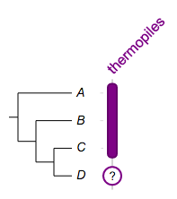
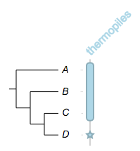
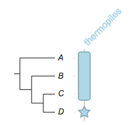
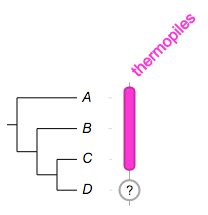
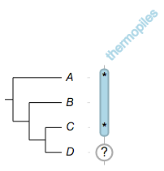
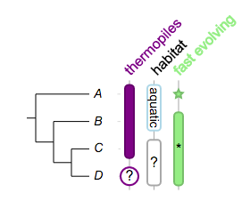

_Please email us ([Evolgenius Team](mailto:evolgenius.team@gmail.com)) if you have any questions; attach your datasets and trees if necessary. _

## Column plots

### Table of contents
* [#overview](#overview)
* [#modifiers](#modifiers)
* [#the !columnPlots modifier](#the-!columnPlots-modifier)
* [#prepare a column of data for visualisation](#prepare-a-column-of-data-for-visualisation)
* [#examples](#examples)
* [#add column plots to collapsed trees](#add-column-plots-to-collapsed-trees)

{anchor:overview}
### Overview
Column plots provides a flexable way of visualising summary information of species in a phylogenetic tree, it was inspired by the figure 6 (the column plots on the right) of a recent publication in eLife:

source: _Laumer, Christopher E., Andreas Hejnol, and Gonzalo Giribet. "Nuclear genomic signals of the ‘microturbellarian’roots of platyhelminth evolutionary innovation." eLife 4 (2015): e05503._
_note_: thanks to Desmond Ramirez of the UCSB who brought this figure to our attention.
here is our implementation in evolview:

The tree:
{{
(A:0.1,(B:0.2,(C:0.3,D:0.4)100:0.05)100:0.1)90:0.43;
}}
... and the dataset:
{{
## --
!columnplots	strokewidth=2,fontbold=1,fontsize=16,textangle=-45,spacebetweencolumns=15

## a column of data starts with a 'namedcolumn',
#it defines global options for the corresponding column
namedcolumn=thermopiles,color=purple:darker
	## followed by the following fragments
	from=A,to=C
	from=D,color=white:purple,text=?,width=20,style=circle,textangle=0

## -- 2nd column
namedcolumn=habitat,width=15
	from=A,to=B,text=aquatic,textangle=-90,color=white:lightblue
	from=C,to=D,text=?,textangle=0,color=white:darkgrey

## -- 3rd column
namedcolumn=fast evolving,color=lightgreen:darker
	from=A,style=star
	from=B,to=D
	from=C,style=none,text=*,textangle=0,width=20
}}

{anchor:modifiers}
### Supported modifiers
Due to the complexity of the plot, we adopted here a new approach for the dataset, thus many so-called universal modifiers are no longer supported except those that are related to the legend. Below are universal modifiers that are still supported by Column plots:
||Key (case insensitive)||Value||Description||
|!Groups or !LegendText|comma separated text|Legend texts; for example 'group_a,group_b,group_c'|
|!LegendStyle or !Style|rect or circle or star|shapes to be plotted before the legend texts; default = rect|
|!LegendColors or !Colors|comma separated color codes or names|colors to be applied to the shapes specified by LegendStyle; for example 'red,green,yellow' ;note the number of colors should match the number of legend fields|
|!Title or !Legend|text|title of the legend; default = name of the dataset|
|!ShowLegends|0 or 1|0 : hide legends; 1 : show legends|
|!opacity|float number between 0 to 1|opacity of the dataset|

{anchor:the !columnPlots modifier}
### the !columnPlots modifier
here we introduce a new modifier **!columnPlots** to allow users to control the following aspect of the plot globally:
* fill and text color
* default stroke color
* default stroke width
* font size, italic, bold and rotation angle
* column width and space between columns
**_please note_** all these global options can be overriden by local settings.
A typical !columnPlots would look like the following (NOTE: this is written in one line, not multiple lines):
{{
!columnPlots    width=10,spaceBetweenColumns=10,color=green:red,strokewidth=1,textangle=-60,style=rect,roundedcorner=5,fontsize=14
}}
please remember always use a 'TAB' character to separate !columnPlots from its value.
The value of !columnPlots is mandatory; it can be any of the following options, individually or in combination:
|| ||alternative value||description||
|width=10|any integer >= 0|set column width, default = 10|
|spaceBetweenColumns=10|any integer >= 0|set space between columns, default = 10|
|style=rect|any of the following:none,rect,circle,star,check,triangle|style / shape to be plotted, default = rect|
|fontsize=10|any integer >= 0|set font size for columns labels, default = 14|
|fontitalic=0|1|set font italic for columns labels, default = 0|
|fontbold=0|1|set font bold for columns labels, default = 0|
|color=red, or color=red:blue|any valid html color name, e.g. green, darkblue ..., or hex html color, e.g. #FF00FF|set fill and optional stroke color; fill color will be also applied to column labels, default = black; see examples below for detail|
|strokewidth=1|any integer >=1|set strokewidth, valid only when the strokecolor is set, default = 1; see examples below for detail|

Please note that Evolview supports the use of "darker", "brighter" and "lighter" as stroke colors. For example, the following usages are all valid:
* red:darker
* #FF00FF:lighter
* darkblue:brighter

When 'darker' or 'brighter'/'lighter' is used, the stroke color will be **_20% darker or brighter_** than the specified color.

See [here](DatasetStroke#use) for more details.

{anchor:prepare a column of data for visualisation}
### prepare a column of data for visualisation
As shown in the previous example, a column of data often consists of _**two parts**_,
1. a line of text starts with a mandatory filed 'namedcolumn=name of the column', followed by any numbers of the options mentioned in the table above, for example:
* namedcolumn=thermopiles,color=purple:darker
* namedcolumn=habitat,width=15
the options following 'namedColumn' control the displaying styles of current column, and overrides the corresponding global options.
2. several lines of text, each line defines a fragment / segment to be plotted. For example:
* from=A,to=C
* from=D,color=white:purple,text=?,width=20,style=circle,textangle=0
the 'fragment' line should contain the following elements:
* the starting point, i.e. the name of the leaf node, of the fragment using 'from='; mandatory
* an optional ending point / the name of a leaf node using 'to='
* any numbers of the options mentioned in the above table; optional. These options control the displaying styles of current fragment, and overrides the corresponding global options
Here is an example:
{{
## a column of data starts with a 'namedcolumn', 
##it defines global options for the corresponding column
namedcolumn=thermopiles,color=purple:darker
	## followed by the following fragments
	from=A,to=C
	from=D,color=white:purple,text=?,width=20,style=circle,textangle=0
}}

**_Note_**:
# the dataset is case-insensitive
# the indentation at the begining of the framents is optional

{anchor:examples}
### Examples
Example 1. a column with two fragments, one span three leaf nodes, while the other spans only one.:
{{
## --
## -- some global options
!columnplots	strokewidth=2,fontbold=1,fontsize=16,textangle=-45

## -- a column with two fragments, note how the stroke color is defined
namedcolumn=thermopiles,color=lightblue:darker
	## note: the indentation is optional
	from=A,to=C
	from=D
}}

----
Example 2. try change the style / shape of the fragments, however it only work when a fragment spans only one leaf node:
{{
##
## -- some global options
!columnplots	strokewidth=2,fontbold=1,fontsize=16,textangle=-45

## -- a column with two fragments, note how the stroke color is defined
namedcolumn=thermopiles,color=lightblue:darker
	## try change the style / shape, but it wouldn't work here
	from=A,to=C,style=star
    ## but, it will work here
	from=D,style=star
}}

----
Example 3. now try change the width of the fragments:
{{
##
## -- some global options
!columnplots	strokewidth=2,fontbold=1,fontsize=16,textangle=-45

## -- set width to 20, it will apply to both fragments
namedcolumn=thermopiles,color=lightblue:darker,width=20
	from=A,to=C,style=star
	from=D,style=star
}}

----
Example 4. of course you can change the widths of the fragments individually:
{{
##
## -- some global options
!columnplots	strokewidth=2,fontbold=1,fontsize=16,textangle=-45

## please note, width=25 here specifies the overall plot width of current column,
##    it is thus meaningful even it is overridden later.
namedcolumn=thermopiles,color=lightblue:darker,width=25
	from=A,to=C,width=10
	from=D,style=star,width=20
}}

----
Example 5. we know for sure the first three species are thermophilic, but the last one???
{{
##
## -- some global options
!columnplots	strokewidth=2,fontbold=1,fontsize=16,textangle=-45

namedcolumn=thermopiles,color=#FF33CC:darker,width=25
	from=A,to=C,width=10
	from=D,style=circle,color=white:darkgrey,width=20,text=?,textangle=0
}}

----
Example 6. now we'd like the readers to pay more attention to species A and C:
{{
##
## -- some global options
!columnplots	strokewidth=2,fontbold=1,fontsize=16,textangle=-45

namedcolumn=thermopiles,color=lightblue:darker,width=25
	from=A,to=C,width=10

	## -- don't forget to set style=none
	from=A,style=none,text=*,fontsize=16,textangle=0
	from=C,style=none,text=*,fontsize=16,textangle=0

	from=D,style=circle,color=white:darkgrey,width=20,text=?,textangle=0
}}

----
Example 7. of course we can have multiple columns in a dataset:
{{
##
!columnplots	strokewidth=2,fontbold=1,fontsize=16,textangle=-45,spacebetweencolumns=15

## a column of data starts with a 'namedcolumn', 
## it defines global options for the corresponding column
namedcolumn=thermopiles,color=purple:darker
	## followed by the following fragments
	from=A,to=C
	from=D,color=white:purple,text=?,width=20,style=circle,textangle=0

## -- 2nd column
namedcolumn=habitat,width=15
	from=A,to=B,text=aquatic,textangle=90,color=white:lightblue,fontsize=14
	from=C,to=D,text=?,textangle=0,color=white:darkgrey

## -- 3rd column
namedcolumn=fast evolving,color=lightgreen:darker
	from=A,style=star
	from=B,to=D
	from=C,style=none,text=*,textangle=0,width=20
}}

----
_**Please NOTE:**_
# the plot is optimized for cladogram and phylogram, thus it wouldn't be as pretty in circular mode
# please send us (evolgenius.team@gmail.com) email if you have encountered any problems using EvolView, attach your tree and datasets if necessary
# please also send us your suggestions and feature requests!
{anchor:add column plots to collapsed trees}
### Add column plots to collapsed trees
Evolview supports collapsing at internal nodes; collapsed nodes are treated as leaf nodes. It is therefore very straightforward to add column plots to a collapsed tree. See [here](DatasetCollapseInternalNodes#columnplots) for more information.

[<< previous section: Bootstrap value styles](DatasetBootstrapValueStyle)      |       [next section: Collapsing tree at internal nodes >>](DatasetCollapseInternalNodes) 

