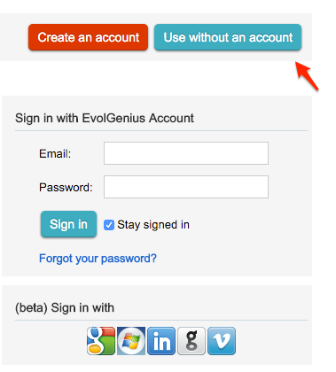
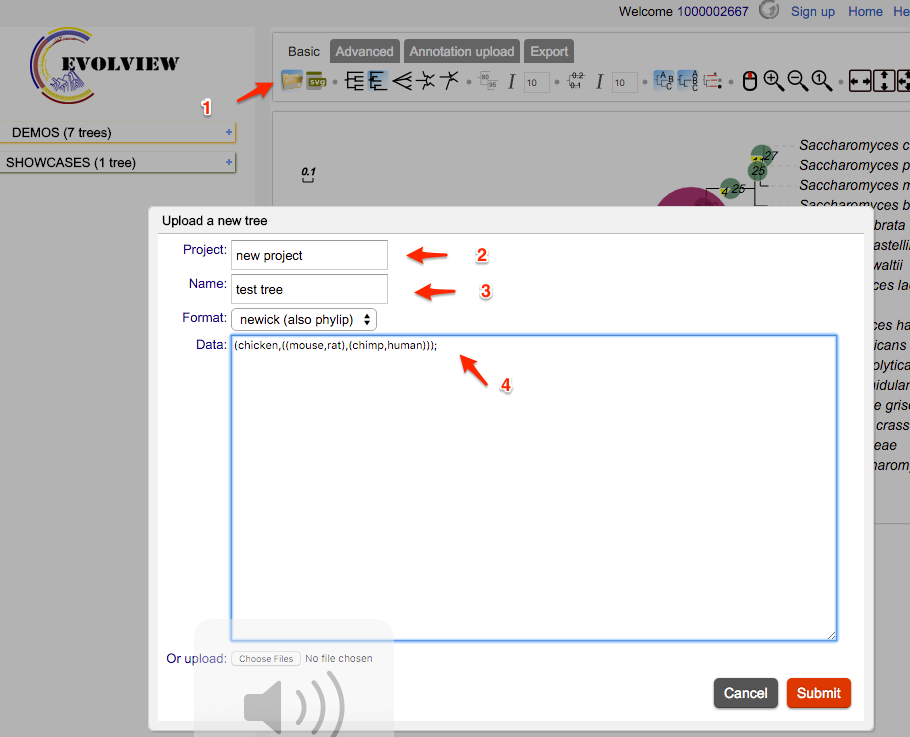
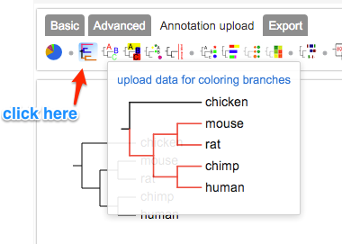
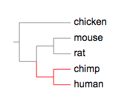
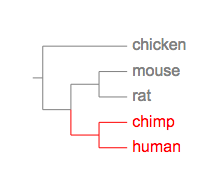
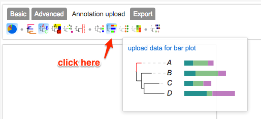
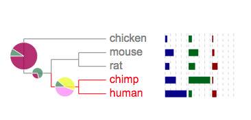
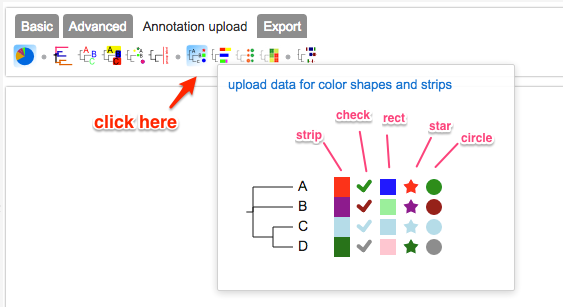
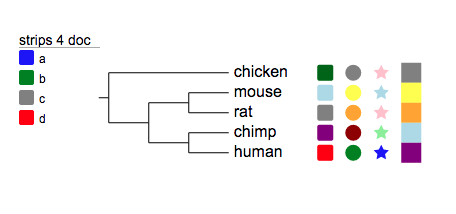
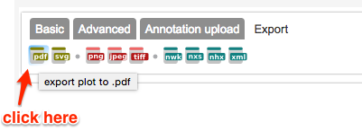

### A quick start
In this "quick start", we'll show you step-by-step how to use this tool to display and customise a tree:
* add a new tree (and a new project),
* change the branch and leaf colors of the tree by uploading some datasets,
* add two extra datasets to the tree,
* play around with the tree and its uploaded datasets, and
* export the customized tree as a pdf file as well as other formats

### Add a new tree to a new project
* at the "login" page, click "Use without an account"

* at the "mytrees" page, click the folder icon on the "Basic" tab (the only icon that's clickable if no tree is active). in the popup window, enter the following contents and click the button "Submit" at the bottom:
{{
Project: new project
Name: test tree
Data: (chicken,((mouse,rat),(chimp,human)));
}}

* the tree will be shown as the following if there is no error in your input:

### Change the branch and leaf colors of the tree
in the following we'll add several datasets to change the appearances of the tree.
Let's use the same tree again:
{{
(chicken,((mouse,rat),(chimp,human)));
}}
* First of all add a dataset named "branch colors" to change the colors of the branches by clicking the "branch colors" icon on the "Annotation upload" tab:

{{
## lines start with # are annotations; you can put an annotation line
##   anywhere in this dataset, provided that the # is the first character
##   of the line
## let the dataset begin: all fields of a line are seperated by 'tab'
## first all, color all branches with 'grey'
human,chicken	grey	ad
## and then highlight the branches connecting human and chimp
human,chimp	red	ad
}}
After applying the dataset:

* then add another dataset to change colors of the tree leaves to match the colors of their corresponding branches by clicking the "tree leaf colors" icon on the "Annotation upload" tab:

{{
## let the dataset begin
##   each line of the 'data part' consists three fields sparated by a 'tab' character
##   the first field specifies the location on the tree; for example 'human' indicates
##     the leaf node representing 'human' or the branch connecting to this leaf node,
##     while 'human,mouse' indicates the internal node representing the
##     last common ancester (LCA) of human and mouse
##   the second field specifies the color to be applied to the corresponding nodes / branches
##   the third field is optional; it can be one the following 'key-words':
##     ad: the color will be applied to all decendents of the node specified by the first field
##     prefix: the color will be applied to all leaf nodes (or connecting branches) whose names
##       start with the string in the first field
##     suffix: the color will be applied to all leaf nodes (or connecting branches) whose names
##       end with the string in the first field
##     anywhere: the color will be applied to all leaf nodes (or connecting branches) whose names
##       contain the string in the first field
## first all, color all leaves to 'grey'
human,chicken	grey	ad
## then, highlight human and chimp with 'red'
human,chimp	red	ad
}}

### Add pie charts to the tree
From this section we'll add some more complicated datasets to the tree.
First of all, some pie charts; the pies will be displayed on the tree branches.
* click the "piechart" icon on the "Annotation upload" tab:
* copy and paste the following to the text box of the popup dialog box:
{{
## created at may 25, 2011
## before the 'data section', now we have a new section that contains
##   lines starting with '!'; this section is called the 'modifier section' because
##   it's used to change / modify the default behaviors of the dataset
!Groups	A,B,C,D
!colors	#9F0251,#f88ef9,#effc00,#4D8963
!legendstyle	rect
!title	example pie chart
!maxradius	20
!minradius	8
!opacity	0.8
chicken,human	50,0,0,5
mouse,human	10,0,0,25
chimp,human	0,20,20,5
}}

### Add bar plots to the tree (next to the leaf labels)
Here we'll add some bar plots to the tree; the bars will be plotted next to the leaf labels.
* first of all, click the "bar plots" icon on the "Annotation upload" tab:

* choose a name for the dataset and copy and paste the following to the text area in the popup dialog box:
{{
##barplots
!groups	a,b,c
!colors	darkblue,darkgreen,darkred
!showLegends	0
!plotwidth	100
!align
!grid
chicken	2,3,1
mouse	8,9,2
human	20,3,4
chimp	10,20,1
rat	4,6,5
}}

### Add colored objects/ shapes to the tree (next to the leaf labels)
Here we'll add a dataset called "color strips / colored shapes".
* click the "color strips" icon on the "Annotation upload" tab:

* copy and paste the following to the text area in the popup dialog box:
{{
##color strips
!groups	a,b,c,d
!colors	blue,green,grey,red
!type	rect,circle,star,strip
!showlegends	1
human	red,green,blue,purple
chimp	purple,darkred,lightgreen,lightblue
mouse	lightblue,yellow
chicken	darkgreen,grey,pink,grey
rat	grey,orange,pink,orange
}}

### Play around and then export the tree to pdf file
* Try different display mode:

* Then download the plot as a PDF file:
