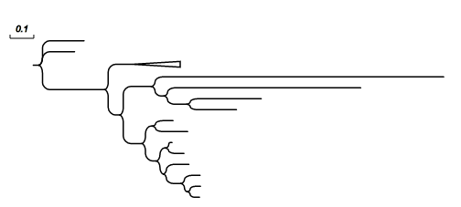
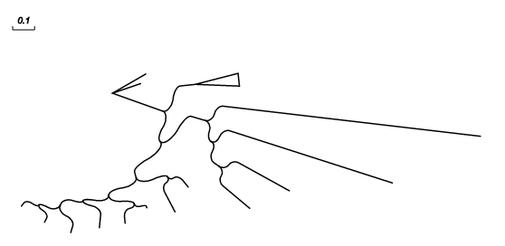

_Please email us ([Evolgenius Team](mailto:evolgenius.team@gmail.com)) if you have any questions; attach your datasets and trees if necessary. _

## Tree visualisation styles
Evolview supports the visualisation of phylogenetic trees as phylograms and cladograms, each in either rectangular or circular layout. 

On top of this, Evolview supports two additional visualisation styles that will make trees stylish. 

Users can turn on/off the following icons of the Toolbar to enable the new styles:

----
Let's see some examples.
First, the tree:
{{
(micsp:0.175257,ostta:0.135164,((chlre:0.261301,cocsp:0.195266)96:0.102648,((phatr:1.215817,(sacce:0.813330,(cyame:0.298556,galsu:0.194230)88:0.095804)34:0.052827)95:0.133765,((phypa:0.072997,s
elmo:0.134491)87:0.042960,((glyma:0.014114,medtr:0.064285)86:0.036407,(arath:0.094434,(zeama:0.065702,(bradi:0.043115,orysaja:0.039021)74:0.024203)100:0.075832)74:0.027208)92:0.061075)99:0.0934
34)77:0.063399)100:0.277431);
}}

visualised in the regular rectangular mode:

----
... additional style 1:

----
... additional style 2:

They work in circular layout as well:

----
