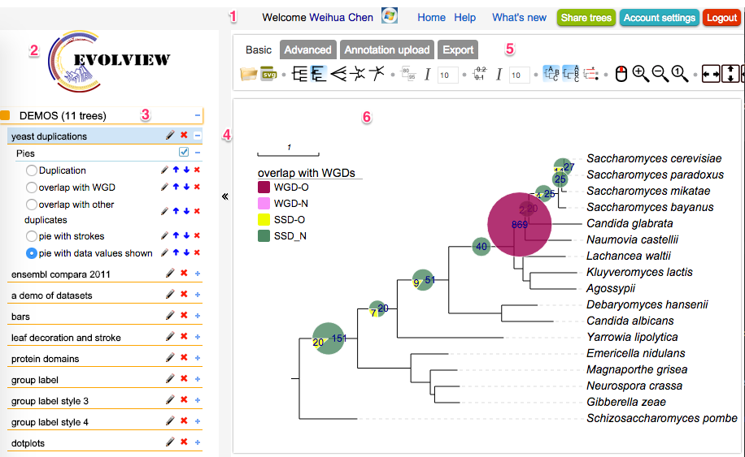

## The interface

Table of contents
* [overview](#the-interface-overview)
* [toolbar](#the-toolbar)
* [canvas](#the-canvas)

### The interface overview

The main user interface consists mainly six components:

1. a header bar. Several widgets are included, including
   * a "account setting" button; for registered users only
   * a "Logout" button.

2. a logo (may be changed over time)
3. a browser panel. Projects and tress for current user will be shown here. Datasets of activated trees will be also shown.
4. a disclosure panel. Click it to hide/ show the logo and the browser panel (to maximize the canvas area (6)).
5. a tool bar (contents may change over time).
6. a canvas to display the active tree.

### The toolbar
The toolbar consists of several tabs, each in turns consists of a collection of buttons and widgets. So far there are four tabs in the toolbar.

The functions of the icons are quite straightforward; mouse over the icons to show tooltips.

### The canvas

The canvas displays your active tree (only once at a time) and active datasets. With the canvas users can :
* change canvas size
* drag the tree around
* zoom in and out the tree
* mouse over tree leaves, nodes and datasets to show additional information in a popup panel
The canvas is featuring WYSIWYG (What-You-See-Is-What-You-Get); what you see at the canvas is what you get when you export your plot to external files.
