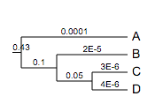

### Table of contents

* [Supported input formats](#supported-input-formats)
* [Supported text output formats](#supported-text-output-formats)
* [Supported graphic output formats](#supported-graphic-output-formats)
* [name internal nodes](#name-internal-nodes)
* [use parentheses in leaf node labels](#use-parentheses-in-leaf-node-labels)
* [Use scientific numbers as branch lengths](#use-scientific-numbers-as-branch-lengths)

### Supported input formats
* newick/ phylip
* nhx
* nexus
* phyloXML (partial; embedded annotations will not be parsed by EvolView for now)

### Supported text output formats
* newick
* nhx
* nexus
* phyloXML

### Supported graphic output formats
* svg (preferred)
* pdf
* png
* jpeg / jpg

### Name internal nodes
* use newick format to name internal nodes
Although Evolview does not support displaying the names of internal nodes (as of Dec 2015), internal nodes can be named. In the newick format, this can be done by adding non-numeric strings next to any right parenthesis in a phylogenetic tree (where the bootstrap values are used to be). For example:

```
# example 1: a tree with named internal nodes;
(A,(B,(C,(D,E)2DE)CDE3)BC3DE)ROOT;  

# example 2: a tree with named internal nodes and branch lengths
(A:0.1,(B:0.2,(C:0.3,(D:0.4,E:0.5)2DE:0.6)CDE3:0.05)BC3DE:0.1)ROOT:0.43;

# example 3: a tree with named internal nodes, branch lengths and bootstrap scores
# in this case, the bootstrap values are put into square brackets
(A:0.1,(B:0.2,(C:0.3,(D:0.4,E:0.5)2DE:0.6[40](40))CDE3:0.05[80](80))BC3DE:0.1[100](100))ROOT:0.43[90](90);
```

* use phyloXML format to name internal nodes
phyloXML format natively supports named internal nodes and can be parsed correctly by Evolview. For example, the phyloXML equivalent of the above 'example 1' should look like:

```xml
<?xml version="1.0" encoding="UTF-8"?><phyloxml xmlns:xsi="http://www.w3.org/2001/XMLSchema-instance" xmlns="http://www.phyloxml.org" xsi:schemaLocation="http://www.phyloxml.org http://www.phyloxml.org/1.10/phyloxml.xsd">
    <phylogeny rooted="true">
        <clade>
            <clade>
                <name>A</name>
            </clade>
            <clade>
                <clade>
                    <name>B</name>
                </clade>
                <clade>
                    <clade>
                        <name>C</name>
                    </clade>
                    <clade>
                        <clade>
                            <name>D</name>
                        </clade>
                        <clade>
                            <name>E</name>
                        </clade>
                        <name>2DE</name>
                    </clade>
                    <name>CDE3</name>
                </clade>
                <name>BC3DE</name>
            </clade>
            <name>ROOT</name>
        </clade>
    </phylogeny>
</phyloxml>
```

... and the phyloXML equivalent of  'example 3' is :

```xml
<?xml version="1.0" encoding="UTF-8"?><phyloxml xmlns:xsi="http://www.w3.org/2001/XMLSchema-instance" xmlns="http://www.phyloxml.org" xsi:schemaLocation="http://www.phyloxml.org http://www.phyloxml.org/1.10/phyloxml.xsd">
    <phylogeny rooted="true">
        <clade>
            <clade>
                <branch_length>0.1</branch_length>
                <name>A</name>
            </clade>
            <clade>
                <clade>
                    <branch_length>0.2</branch_length>
                    <name>B</name>
                </clade>
                <clade>
                    <clade>
                        <branch_length>0.3</branch_length>
                        <name>C</name>
                    </clade>
                    <clade>
                        <clade>
                            <branch_length>0.4</branch_length>
                            <name>D</name>
                        </clade>
                        <clade>
                            <branch_length>0.5</branch_length>
                            <name>E</name>
                        </clade>
                        <branch_length>0.6</branch_length>
                        <confidence type="unknow">40</confidence>
                        <name>2DE</name>
                    </clade>
                    <branch_length>0.05</branch_length>
                    <confidence type="unknow">80</confidence>
                    <name>CDE3</name>
                </clade>
                <branch_length>0.1</branch_length>
                <confidence type="unknow">100</confidence>
                <name>BC3DE</name>
            </clade>
            <branch_length>0.43</branch_length>
            <confidence type="unknow">90</confidence>
            <name>ROOT</name>
        </clade>
    </phylogeny>
</phyloxml>
```

### Use parentheses in leaf node labels

Evolview supports the use of parentheses in leaf names. As long as they come in pairs, parentheses can be put at anywhere (start, end, middle) of the leaf name; multiple and nested parentheses in a single leaf name are also supported.

For example, the tree below:

```
( ( (
(A)(NC_1)B(C):0.4,
((B)B_(NC_2)):0.3)90:0.2,
(
C_(NC_3):0.1,
(D_(NC_4)):0.001)75:0.2 )90:0.3,
E_(NC_5)_E:0.44 )100:0.3;
```

will be visualised as:


### Use scientific numbers as branch lengths

Float numbers less than 0.0001 (1e-4; non-inclusive) will be displayed as scientific numbers. For example, the tree:

```
(A:0.0001,(B:0.00002,(C:0.000003,D:0.000004)100:0.05)100:0.1)90:0.43;
```

will be visualised as:



In addition, branch lengths can be directly written as scientific numbers. For example, the following tree will be correctly parsed and visualised:

```
(A:1e-2,(B:0.00002,(C:0.000003,D:1.45e-5)100:0.05)100:0.1)90:0.43;
```


