## What's new

### Citations
* _Please email us ([Evolgenius Team](mailto:evolgenius.team@gmail.com)) if you have any questions; attach your datasets and trees if necessary. _

* _please **Cite us**_ if you find this tool useful:
	* He et al, Evolview v2: an online visualization and management tool for customized and annotated phylogenetic trees, Nucleic Acids Res, (2016). ([http://nar.oxfordjournals.org/content/early/2016/04/30/nar.gkw370.full](http://nar.oxfordjournals.org/content/early/2016/04/30/nar.gkw370.full))
	*  Zhang et al. EvolView, an online tool for visualizing, annotating and managing phylogenetic trees. Nucleic Acids Res (2012) pp. 4. ([http://nar.oxfordjournals.org/content/40/W1/W569](http://nar.oxfordjournals.org/content/40/W1/W569)). See also the [citation page](/miscs/citation.md).

### June~Aug, 2017
* added HTML mode;
  * the documentation is to be written.

### July 17, 2017
* bug fixes as always
  * fixed an issue that leaf label background overlaps with group labels of style 1
  * fixed an issue that the background box is smaller than the leaf label; also improved cross-browser compatibility on this issue

### July 11, 2017
* our documentation has been moved to GitHub!!!

Long-time users may still remember that Evolview documentation was originally hosted at Google Code, then was moved to MicroSoft CodePlex. This may never happen but let us hope that we do NOT have to move again!!!

### Jan 19, 2017
* use '!colorRecycle' modifier to stop recycling colors in "Color shapes and strips" plot.

For example by default colors will be recycled:

The tree:

```
(chicken,((mouse,rat),(chimp,human)));
```

----

```
##color strips
!type	strip,rect,circle,star,check,triangle
!showlegends	1
!defaultstrokewidth	2
!plotwidth	200
!colorRecycle	1

## let the data begin
mouse	pink,red,green,blue:brighter
chicken	yellow,purple,white:darkred,lightgreen:darker

## -- two objects will be plotted instead of six --
rat	lightblue,white:lightblue
chimp	grey,darkgreen:brighter,grey:darker,pink:darker
human	orange,red,white:gold,lightblue
```


----
However, set  '!recycleColor' or '!colorRecycle' to 0 will stop cycling the colors:

```
##color strips
!type	strip,rect,circle,star,check,triangle
!showlegends	1
!defaultstrokewidth	2
!plotwidth	200

## -- recycle color, default is true --
## -- !type determines that maximally six objects will be displayed
## -- normally user-supplied colors will be recycled; for example,
## -- however, when !recycleColor is set to 0, the colors will not be recycled
!colorRecycle	0

## let the data begin
mouse	pink,red,green,blue:brighter
chicken	yellow,purple,white:darkred,lightgreen:darker

## -- two objects will be plotted instead of six --
rat	lightblue,white:lightblue
chimp	grey,darkgreen:brighter,grey:darker,pink:darker
human	orange,red,white:gold,lightblue
```


----

### Dec 29, 2016
* bug fixes
	* fixed a bug that the header disappeared in Mac Safari

### Nov 2, 2016
* bug fixes
	* fixed a bug that exporting to PDF fails on some circular group labels

### Aug 25, 2016
* bug fixes
	* fixed a bug that the exporting to png/jpeg/tiff functionality fails from time to time

### May 25, 2016
* bug fixes as always
* added support for two additional tree visualisation styles that can be used in combination with phylograms and cladograms. See [here](TreeStyles) for more information.

Here is an example:
1. the original tree:

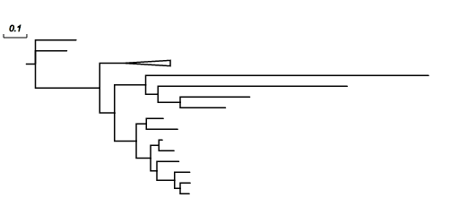

----

2. in combination with style 1:


----

3. in combination with style 2:


To turn on/off the new visualisation styles, use the corresponding icons on the Toolbar (as shown below):

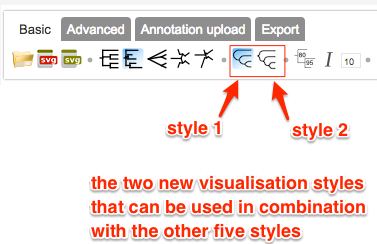

### May 22, 2016;
* bug fixes

### May 20, 2016
* bug fixes as always
* added support for a new bootstrap value style

here is the tree:

```
(A:0.1,(B:0.2,(C:0.3,(D:0.4,E:0.5)40:0.6)80:0.05)100:0.1)90:0.43;
```

the dataset:

```
## place=4
!bootstrapValueStyle	show=1,style=numeric,place=4,color=darkred
```

and the visualisation results:


### May 19, 2016
* added support for [multiple sets of bootstrap values](/datasets/11_bootstrap/DatasetBootstrapValueStyle.md); here is an example:

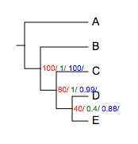

See [here](/datasets/11_bootstrap/DatasetBootstrapValueStyle.md) for more information and examples.

### May 18, 2016
* added a new annotation type: [TimeLine](/datasets/14_timeline/DatasetTimeLine.md); here is an example:

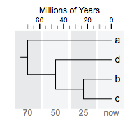

See [here](/datasets/14_timeline/DatasetTimeLine.md) for more information and examples.

### Mar 1, 2016
* bug fixes as always ...
* allow user to copy datasets from one tree to others

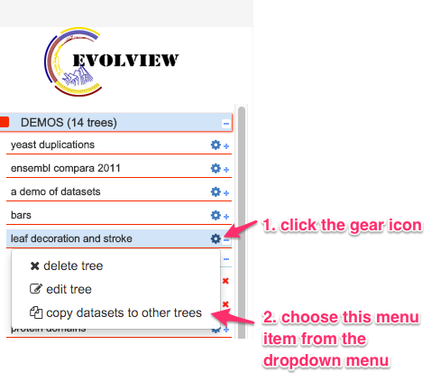

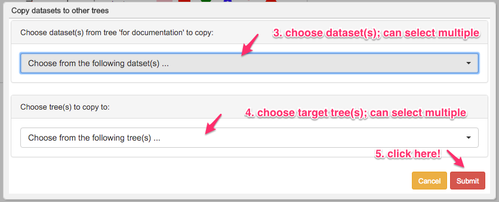

### Feb 19, 2016
* updated user interface for tree sharing

### Feb 3, 2016
* bug fixes
	* fixed a bug that the charts are not updated after the leaf labels are switched on/off

### Jan 29, 2016
* now Evolview is equipped with a "CodeMirror"-powered text-editor that features:
	* line numbers
	* current row highlight
	* keywords highlight

See the screenshot below:

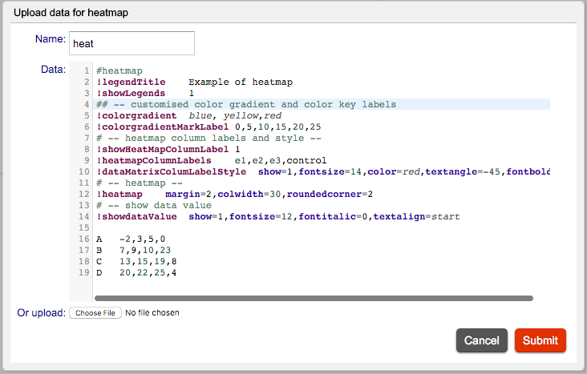

### Jan 28, 2016
* use scientific numbers as branch lengths

Float numbers less than 0.0001 (1e-4; non-inclusive) will be displayed as scientific numbers. For example, the tree:

```
(A:0.0001,(B:0.00002,(C:0.000003,D:0.000004)100:0.05)100:0.1)90:0.43;
```

will be visualised as:


In addition, branch lengths can be directly written as scientific numbers. For example, the following tree will be correctly parsed and visualised:

```
(A:1e-2,(B:0.00002,(C:0.000003,D:1.45e-5)100:0.05)100:0.1)90:0.43;
```

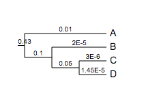

### Jan 26, 2016
* bug fixes
	* fixed an issue caused by Google Chrome ver 48+
	* datasets for 'Bootstrap value style' can only be uploaded for trees with bootstrap values (of course)
	* fixed an issue that causes blank page in certain browsers after the deployment of a new version

### Jan 20, 2016
* added support for collapsing at internal nodes; with this annotation type, users can :
	* collapse at internal nodes
	* show a small triangle at the collapsed nodes that is proportional to the number of leaves that the collapsed node contains

Here is an example:


See [here](/datasets/13_collapse_at_internal_nodes/DatasetCollapseInternalNodes.md) for more information and examples.

### Jan 14, 2016
* now Evolview can correctly parse and display parentheses in leaf node names. As long as they come in pairs, parentheses can be put at anywhere (start, end, middle) of the leaf name; multiple and nested parentheses in a single leaf name are also supported.

For example, the tree below:

```
( ( (
(A)(NC_1)B(C):0.4,
((B)B_(NC_2)):0.3)90:0.2,
(
C_(NC_3):0.1,
(D_(NC_4)):0.001)75:0.2 )90:0.3,
E_(NC_5)_E:0.44 )100:0.3;
```

will be visualised as:


### Dec 6, 2015
* added a new type anntation dataset: Column plots, it allow users to visualise complex summary information of species in a phylogenetic tree, here is an example:


See [here](/datasets/12_column_plot/DatasetColumnPlots.md) for more information.

### Dec 5, 2015
* added support for the use of 'darker' or 'brighter' as stroke colors, see the section ['Stroke color and width'](/datasets/01_stroke_color_and_width/DatasetStroke.md) and related sections in the annotation datasets.

for example:
	* green:darker == use darker green as stroke color; the stroke color is usually 20% darker than the specified color
	* purple:ligher or purple:brighter == use lighter purple as stroke color; the stroke color will be 20% brighter than the specific color

Here are some examples:


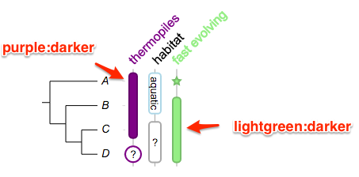

### Dec 4, 2015
* added a new type of annotation dataset: bootstrap value styles, it allows users to change the
	* visiblity
	* color
	* size
	* style / shape and
	* position of the bootstrap scores according to their
	* values, e.g. 40, or
	* value ranges, e.g. 10~60

see [here](/datasets/11_bootstrap/DatasetBootstrapValueStyle.md) for detail.

Here are some examples:

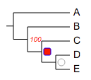

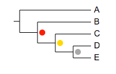


### Dec 1, 2015
* added a new modifier '!columLabelStyle' to allow user to customize the column labels for [dotplot](/datasets/09_dot_plot/DatasetDotplots.md) and [heatmap](/datasets/10_heatmap/DatasetHeatmap.md), below is an example:


### Nov 30, 2015
* bug fixes as usual
* added a new option 'valuesToHide' for modifier !showDataValue of the dot plots; below is an example; see here for more information: [values to hide](/datasets/09_dot_plot/DatasetDotplots.md)


### April 4, 2015
* bug fixes as always
* added a new annotation type, [heatmap](/datasets/10_heatmap/DatasetHeatmap.md):


### March 31, 2015
* bug fixes (there are always bugs somewhere ... )
* added a new annotation type: [dot plot](/datasets/09_dot_plot/DatasetDotplots.md); here is an example:


### March 24, 2015
* bug fixes
* updated the pfam domain api
* added four more styles for group labels; See [here](/datasets/08_group_label/DatasetGroupLabel.md) for the documentation.
* added two more example trees to the 'DEMOS' project to showcase the group labels

### Jan 2, 2015
* fixed a bug in tree sharing caused by case-sensitive setting of MySQL at the server-end

### Dec 15, 2014
* a major update has just been released, with a new feature that allows users to share trees to others to view, interact and even edit. See here for the documentation.
* NOTE: this function is still under development; bugs are thus expected. Please send us feature requests, comments and suggestions!!

### Dec 15, 2014
* added support for a new type of annotation: [Group Labels](/datasets/08_group_label/DatasetGroupLabel.md); here is an example:

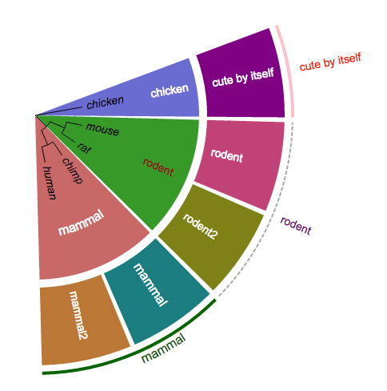

### Oct 9, 2014
* bug fixes

### Oct 1, 2014
* fixed a UI bug that the UI behaves differently between firefox and google chrome.

### Sep 28, 2014
* added support for the display of data values in pie and bar charts; see trees 'yeast duplicates' and 'bars' in the "DEMOS" project.

[pie chart](/datasets/02_pie/DatasetPieCharts.md):

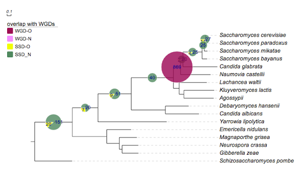

[bar chart](/datasets/03_bar/DatasetBars.md):


### Sep 23, 2014
* added a new button "show /hide lines linking leaf labels and datasets" to the "Basic" tab; mouse over this icon to see larger image for more details.

### July 4, 2014
* bug fix

### June 23, 2014
* added rotate subtree at internal nodes

### June 20, 2014
* bug fix: fixed a bug that the tree panel doesn't show properly in Firefox

### June 18, 2014
* added support for navigation (beta)
* added a new modifier 'toroot' for branch colors; see here for examples

### April 2, 2014
* now Firefox is officially back!! Enjoy!!

### March 27, 2014
* new features:
	* add support for stroke colour and stroke width; see here for more details
	* add a new dataset type : Leaf label decorations

### Sep 11, 2013
* fix a bug with trees that have bootstrap values but no branch lengths : ((a,b)0.88,(c,d)0.99);
* new features:
	* (beta) social login: now evolview supports OAuth 2.0, an open standard for authorization; users can login with existing accounts including Facebook, Gmail, Windows Live, Yahoo and many others. See here for more information about OAuth: http://en.wikipedia.org/wiki/OAuth
	* now users can set the fonts of bootstrap or branch length values to italic and change their sizes; all changes will be saved on to the server

### April 18, 2013
* fix a bug caused by tree like this '((a:1,b):3,(c:1,(d:1,e:3):1):2);'
* new features:
	* temporary users can save their trees, projects and datasets on our server up to 7 days and the keys for accessing the data are saved in browser cookies (clearing the browser cookies will lose the keys) (Note: each temporary use would have a unique ID, she / he can use it to retrieve their data by emailing it to the server administrator )
	* when creating a new account, temporary uses can choose to move their data to the newly created account

### May 22, 2012
* manuscript accepted for publication on NAR 2012 Web Server issue. Check it out on the publisher's website: http://nar.oxfordjournals.org/content/40/W1/W569

### Build# 510; May 15, 2012
* add visualisation for [protein domains](/datasets/07_protein_domain/DatasetProteinDomain.md)
* add automatic annotation for protein domains using tree leaf label names to query against PFAM database

### Build# 500; May 12, 2012
* fix a bug on parsing the bootstrap scores in newick format
* fix some usability issues

### Build# 450; Apr 23, 2012
* improvement on pie-chars: now user can specify whether to use the summation of a row as the area of a pie, or the radius
* now each plotmode/ treemode has independent translateX, Y as well as pixal per width values; and all these values will be saved on our server if a user is logged in
* fix a bug on parsing the bootstrap scores in PhyloXML format

### Build# 412; Feb 14, 2012
* fix several bugs on submitting datasets to trees;
* fix a bug on parsing "legend"-related information from datasets

### Build# 400; Feb 2, 2012
* the last active tree will be loaded automatically when sign in; however, if the last active tree is in project "DEMOS", no tree will be loaded
* better compatibility (import/ export) with the following formats: nexus, phyloXML; better support for internal branches from imported trees
* new download popup panel

### Build# 380; Jan 17, 2012
* zoom in and out at the mouse pointer
* fix a bug at parsing trees in PhyloXML format
* add statistics on users' visits per month (click the EvolView logo at the login page to view the statistics)
* add more interactivity with the tree branches

### Build# 200; milestone 1; Dec 28, 2012
* first version available online
* manuscript submitted to NAR web server issue 2012
